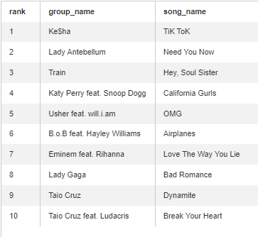
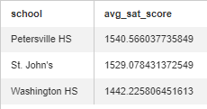
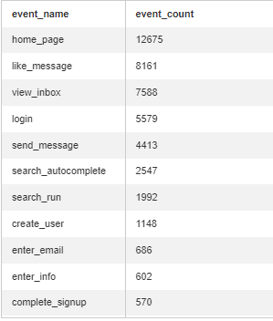

# Basic SQL Exercises (*with Solution*)

## Instructions
- Log-in to your Strata Scratch account.
- All tables used in this exercise are taken from the datasets schema. Make sure you select this schema on the SQL editor settings.
- Try to answer the following questions by writing the appropriate SQL query on the editor.
- This is the teacher version of the SQL basic exercises. Each question is followed with the right solution and correct output.

## Questions
1. How many of passengers embarked on the Titanic? 
   
   `Table: datasets.titanic`
   
   *Solution:*
   ```sql
      SELECT count(distinct name)
      FROM datasets.titanic
   ```  
   *Output:* `891`
   
2. How many passengers were in first class (pclass =1), a woman, and survived (survived = 1)?
   
   `Tables: datasets.titanic`
   
   *Solution:*
   ```sql
      SELECT
        count(distinct passengerid)
      FROM datasets.titanic
      WHERE
        pclass = 1
        AND sex = 'female'
        AND survived = 1
   ```
   *Output:* `91`
   
3. How many athletes participated in the 2014 combine?
   
   `Tables: datasets.nfl_combine`
   
   *Solution:*
   ```sql
      SELECT count(distinct name)
      FROM datasets.nfl_combine
      WHERE year = '2014'
   ```
   *Output:* `335`
   
4. What is the average weight of all the athletes?
   
   `Tables: datasets.nfl_combine`
   
   *Solution:*
   ```sql
      SELECT
        avg(weight)
      FROM datasets.nfl_combine
   ```
   *Output:* `245.6`
   
5. How many athletes were drafted into NFL in 2015?
   
   `Tables: datasets.nfl_combine`
   
   *Solution:*
   ```sql
      SELECT
        count(distinct name)
      FROM datasets.combine
      WHERE year = 2015
      AND (pickround NOTNULL or pickround <> '0')
   ```
   *Output:* `321`
   
6. How many accounts performed a login in 2016?
   
   `Tables: datasets.product_logins`
   
   *Solution:*
   ```sql
      SELECT 
        count(distinct account_id)
      FROM datasets.product_logins
      WHERE login_date BETWEEN '2016-01-01' and '2016-12-31'
   ```
   *Output:* `156832`
   
7. What were the top 10 songs in 2010?
   Include the rank, group name, and song name from highest ranked song to lowest.
   
   `Tables: datasets.billboardtop_100year_end`
   
   *Solution:*
   ```sql
      SELECT
        year_rank as rank, 
        "group" as group_name,
        song_name as song_name
      FROM datasets.billboard_top_100_year_end
      WHERE year = 2010
      AND year_rank BETWEEN 1 and 10
      GROUP BY 1,2,3
      ORDER BY year_rank ASC
   ```
   *Output:*
   
   
8. What is Samantha’s and Lisa’s total sales revenue?

   `Tables: datasets.sales_performance`
   
   *Solution:*
   ```sql
      SELECT
        sum(sales_revenue) as total_revenue
      FROM datasets.sales_performance
      WHERE salesperson = 'Samantha' or salesperson = 'Lisa'
   ```
   *Output:* `112650`
   
9. What is the average SAT score by school? Rank by highest average SAT score

   `Tables: datasets.sat_scores`
   
   *Solution:*
   ```sql
      SELECT
        school, 
        avg(sat_math + sat_verbal + sat_writing) as avg_sat_score
      FROM datasets.sat_scores
      GROUP BY 1
      ORDER BY avg_sat_score DESC
   ```
   *Output:*
   
   
10. Count the number of user events by `event_name` from users on a macbook pro.
    Output should be ranked with highest event count first.

    `Tables: datasets.playbook_events`
    
    *Solution:*
    ```sql
       SELECT
         event_name,
         count(*) as event_count
       FROM datasets.playbook_events
       WHERE device = 'macbook pro'
       GROUP BY 1
       ORDER BY event_count DESC
    ```
    *Output:*
    
    


