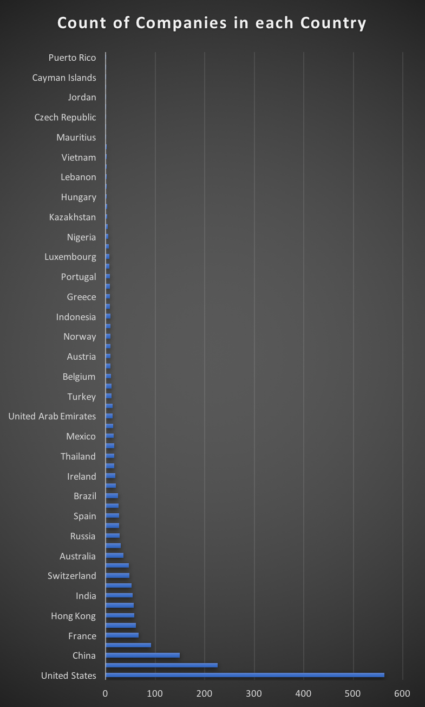
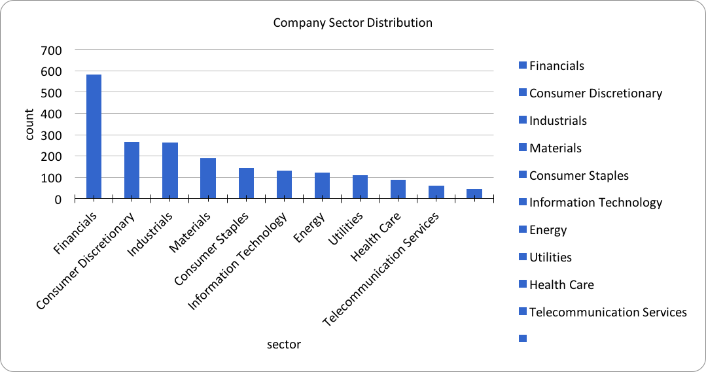
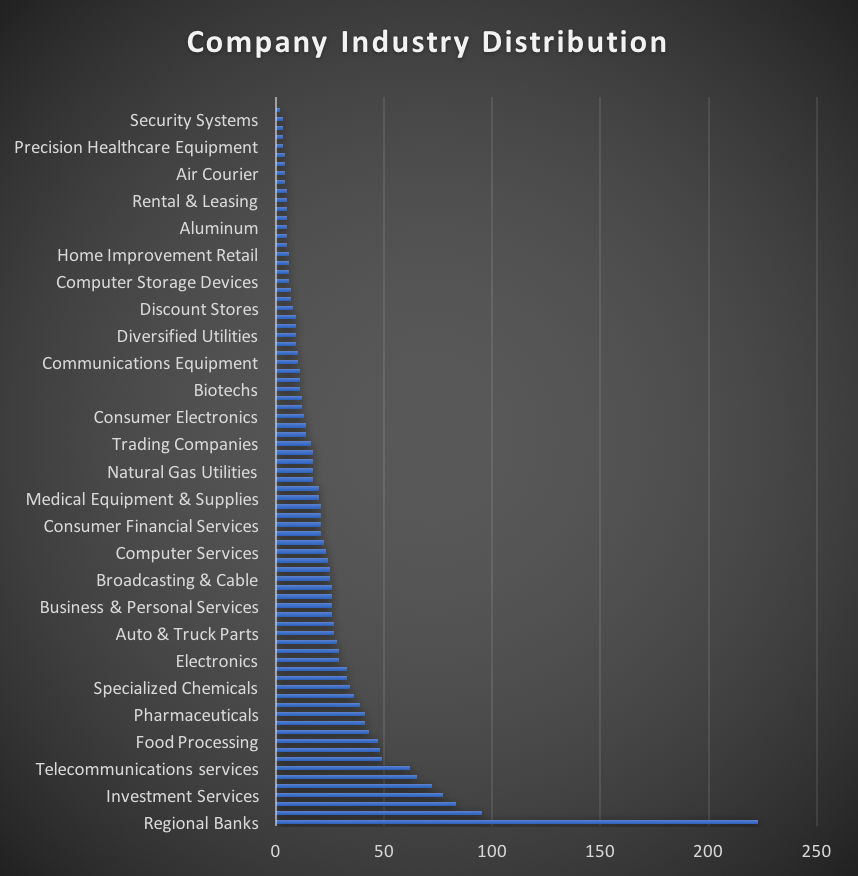
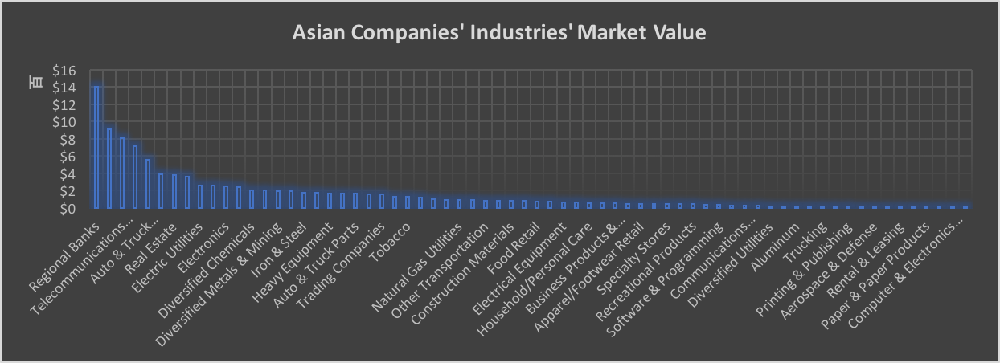
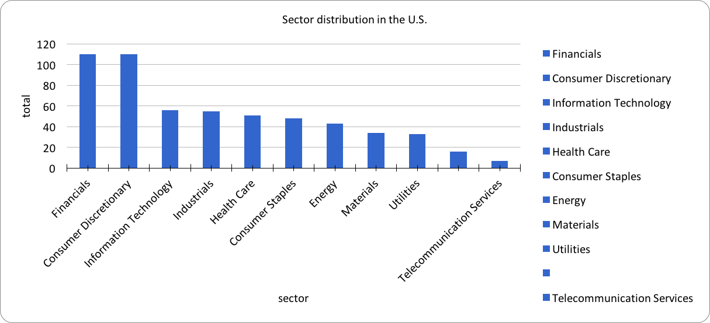
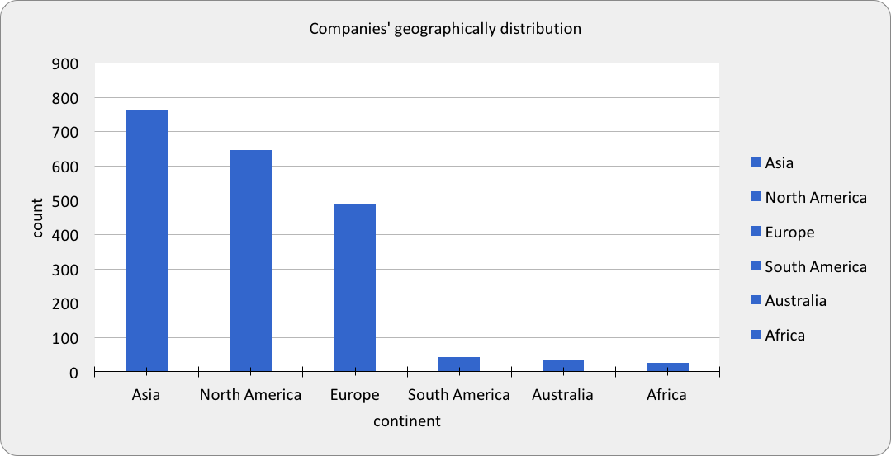

# Forbes Global Exercise Solutions

The Forbes Global 2000 is an annual ranking of the top 2,000 public companies in the world by Forbes magazine. 
The ranking is based on a mix of four metrics: sales, profit, assets and market value. The list has been published since 2003. 
Our dataset consists of 2000 rows and 10 columns. The columns are rank, company, country, continent, sector, industry, market value, 
sales, profits, and assets. The purpose of this dataset is to help you figure out what kind of industries are currently the most
profitable and popular, as well as the top countries that are currently having these companies.

### Question 1
Which country has the most companies from the dataset?

*Solution:*
```sql
  SELECT country, count(company)
  FROM datasets.forbes_global_2010_2014
  GROUP BY country
  ORDER BY count (company) DESC 
```


### Question 2
Which is the most popular sector from the list?

*Solution:*
```sql
  SELECT sector, count(*) 
  FROM datasets.forbes_global_2010_2014
  GROUP BY sector
  ORDER BY count DESC
```


### Question 3
What industries do most companies are in?

*Solution:*
```sql
  SELECT industry, count(company)
  FROM datasets.forbes_global_2010_2014
  GROUP BY industry
  ORDER BY count (company) DESC 
```


### Question 4
What is the average profit of the major banking industry?

*Solution:*
```sql
  SELECT avg(profits)
  FROM datasets.forbes_global_2010_2014
  WHERE industry = 'Major Banks' 
```
*Answer:* `4.58`

### Question 5
Which industry has the highest market value in Asia?

*Solution:*
```sql
  SELECT industry, sum(marketvalue) AS total_marketvalue
  FROM datasets.forbes_global_2010_2014 
  WHERE continent = 'Asia'
  GROUP BY industry
  ORDER BY total_marketvalue DESC
```


### Question 6
What is the total market value of the financial sector?

*Solution:*
```sql
  SELECT sum(marketvalue) AS total_marketvalue
  FROM datasets.forbes_global_2010_2014 
```
*Answer:* `44410.3`

### Question 7
How many American companies are on the list?

*Solution:*
```sql
  SELECT count(company)
  FROM datasets.forbes_global_2010_2014
  WHERE country= 'United States'
```
*Answer:* `563`

### Question 8
What are the top 3 sectors in the United States?

*Solution:*
```sql
  SELECT sector
  FROM datasets.forbes_global_2010_2014
  WHERE country= 'United States'
  ORDER BY rank ASC
```


### Question 9
What are the total assets of the energy sector?

*Solution:*
```sql
  SELECT sum(assets)
  FROM datasets.forbes_global_2010_2014
  WHERE sector= 'Energy'
```
*Answer:* `6564.7`

### Question 10
Which continent has the most companies?

*Solution:*
```sql
  SELECT continent, count(company)
  FROM datasets.forbes_global_2010_2014
  GROUP BY continent
  ORDER BY count (company) DESC
```

