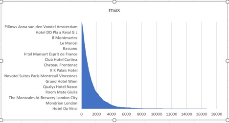
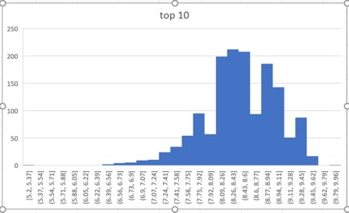
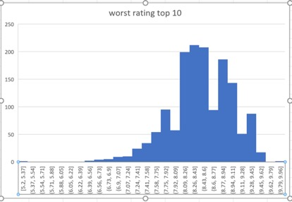
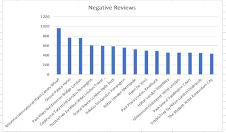
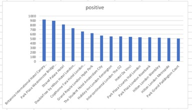
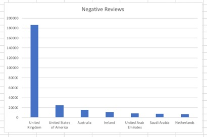
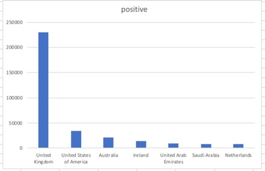
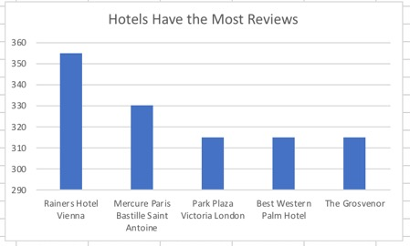

# Hotel Reviews Exercises

This dataset contains 515,000 customer reviews and scores of 1493 luxury hotels across Europe.
The geographical location of hotels is also provided for further analysis.

### Question 1
Which hotel has the most reviews?

*Solution:*
```sql
  SELECT DISTINCT hotel_name,
    max(total_number_of_reviews) AS max
  FROM datasets.hotel_reviews 
  GROUP BY 1
  ORDER BY max DESC
```
*Answer:* `Hotel Da Vinci = 16670`



### Question 2
What is the average of total negative reviews' word counts?

*Solution:*
```sql
  SELECT avg(review_total_negative_word_counts)
  FROM datasets.hotel_reviews
```
*Answer:* `19`

### Question 3
What is the average of total positive reviews' word counts?

*Solution:*
```sql
  SELECT avg(review_total_positive_word_counts) 
  FROM datasets.hotel_reviews
```
*Answer:* `18`

### Question 4
Which hotels have the highest rating? Show the top 10.

*Solution:*
```sql
  SELECT hotel_name, average_score
  FROM datasets.hotel_reviews 
  GROUP BY hotel_name,average_score 
  ORDER BY average_score DESC 
```


### Question 5
Which hotels have the worst rating? Show the top 10.

*Solution:*
```sql
  SELECT hotel_name, average_score 
  FROM datasets.hotel_reviews 
  GROUP BY hotel_name,average_score
  ORDER BY average_score ASC
```


### Question 6
Which hotels have the most negative reviews in the summertime (June-Aug)? Show top 10.

*Solution:*
```sql
  SELECT hotel_name, 
  COUNT(negative_review) AS negative 
  FROM datasets.hotel_reviews 
  WHERE NOT negative_review= 'No Negative' AND review_date BETWEEN '6/1/17' AND '8/31/17'
  GROUP BY hotel_name
  ORDER BY negative DESC
  LIMIT 15
```


### Question 7
Which hotels have the most positive reviews in the summertime (June-Aug)? Show top 10.

*Solution:*
```sql
  SELECT hotel_name,
  COUNT(positive_review) AS positive 
  FROM datasets.hotel_reviews 
  WHERE NOT positive_review= 'No Positive' AND review_date BETWEEN '6/1/17' AND '8/31/17'
  GROUP BY hotel_name
  ORDER BY positive DESC
  LIMIT 15
```


### Question 8
Which countries have the most negative reviews?

*Solution:*
```sql
  SELECT reviewer_nationality, count(negative_review) AS negative
  FROM datasets.hotel_reviews
  WHERE NOT negative_review = 'No Negative'  
  GROUP BY reviewer_nationality
  ORDER BY  negative desc
```


### Question 9
Which countries have the most positive reviews?

*Solution:*
```sql
  SELECT reviewer_nationality, count(positive_review) AS positive
  FROM datasets.hotel_reviews
  WHERE NOT  positive_review = 'No Positive'
  GROUP BY reviewer_nationality
  ORDER BY  positive desc
```


### Question 10
Which hotels got the most reviews that a particular reviewer has given?

*Solution:*
```sql
  SELECT hotel_name,MAX(total_number_of_reviews_reviewer_has_given) max
  FROM datasets.hotel_reviews
  GROUP BY hotel_name
  ORDER BY max DESC
  LIMIT 5
```

