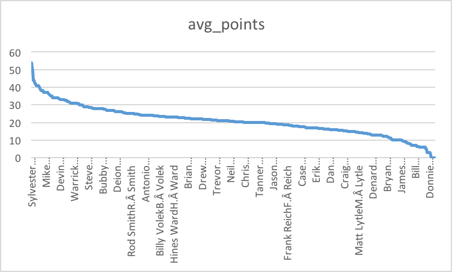
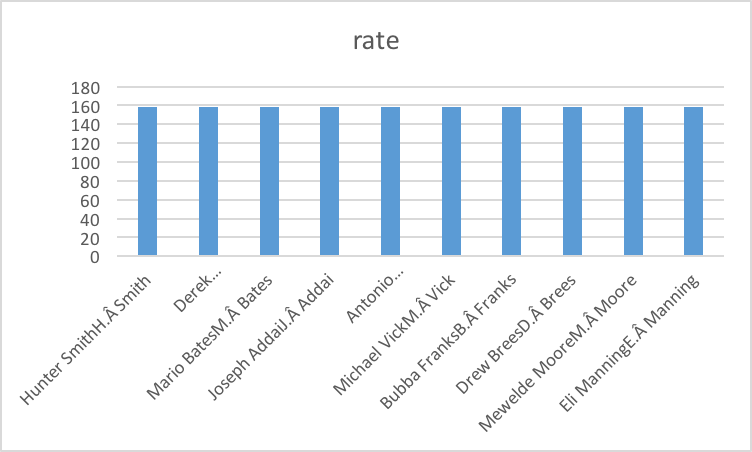
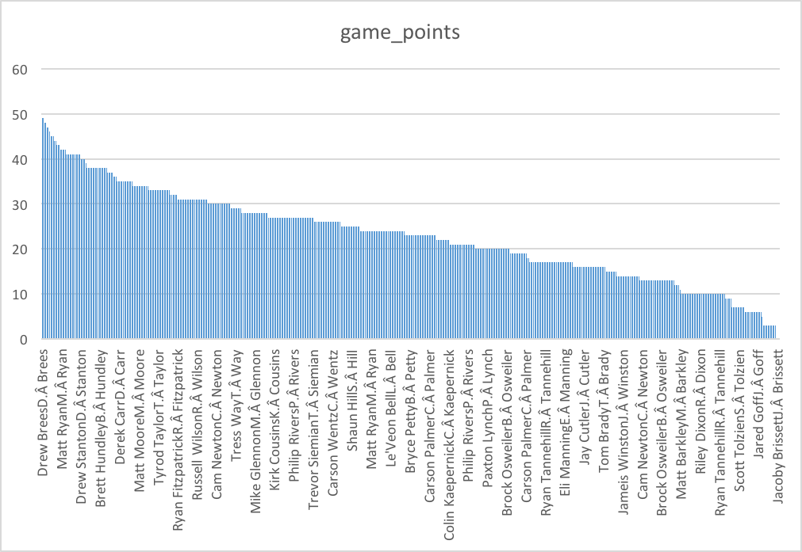
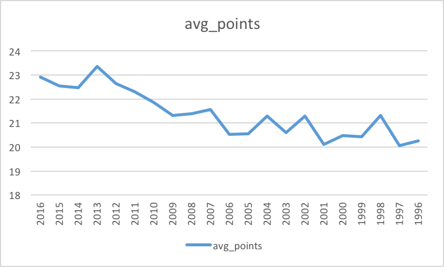
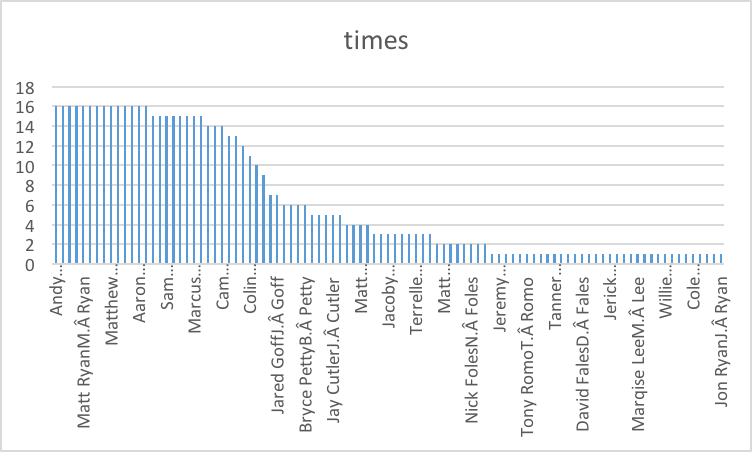

# QB Stats Exercises

This dataset gives information on every NFL game and every passer over 5000 regular season games from 1996 to 2016. 
The excel files supply us with over ten thousand quarterbacks’ names over 21 years and specify the success of each one. 
Each year contains every single game from that season and gives statistics like completions, attempts, yards, and an overall 
rating for the quarterback for that game.

### Question 1
Which quarterback has the highest game points?

*Solution: *
```sql
  SELECT qb, avg(game_points) AS avg_points
  FROM datasets.qbstats_1996_2016
  GROUP BY qb
  ORDER BY avg_points DESC
```


### Question 2
Who were the top 10 highest rating quarterbacks?

*Solution:*
```sql  
  SELECT qb, rate
  FROM datasets.qbstats_1996_2016
  WHERE rate is NOT NULL
  GROUP BY qb,rate
  ORDER BY rate DESC
  LIMIT 10
```


### Question 3
Who were the top 10 quarterbacks with the highest game points in 2016?

*Solution:*
```sql
  SELECT qb, game_points
  FROM datasets.qbstats_1996_2016
  WHERE year = 2016
  ORDER BY game_points DESC
  LIMIT 10
```


### Question 4
Where do the quarterbacks perform better in 2016, at home or away?

*Solution:*
```sql
  SELECT qb, game_points, home_away
  FROM datasets.qbstats_1996_2016
  WHERE year=2016
  ORDER BY game_points DESC
```

### Question 5
What is the average game points each year?

*Solution:*
```sql
  SELECT year, avg(game_points) as average_points
  FROM datasets.qbstats_1996_2016
  GROUP BY year
  ORDER BY year DESC
```


### Question 6
Who throws the longest in 2016?

*Solution:*
```sql
  Select qb, lg as longest_throw
  From datasets.qbstats_1996_2016
  Where year = 2016
  Group by qb, longest_throw
  Order by longest_throw DESC
```

### Question 7
Who had the most touchdowns (TD) in 2016?

*Solution:*
```sql
  SELECT qb, count(td) as times
  FROM datasets.qbstats_1996_2016
  WHERE year = 2016
  GROUP BY qb
  ORDER BY times DESC
```

### Question 8
Which quarterback played in the most games in 2016?

*Solution:*
```sql
  SELECT qb, count(qb) AS most_appearances
  FROM datasets.qbstats_1996_2016
  WHERE year = 2016 
  GROUP BY qb
  ORDER BY most_appearances DESC
```

### Question 9
Which quarterback had the least amount of interceptions in 2016?

*Solution:*
```sql
  SELECT qb, count(int) AS least_interceptions
  FROM datasets.qbstats_1996_2016
  WHERE year = 2016
  GROUP BY qb
  ORDER BY least_interceptions ASC
```

### Question 10
Which quarterback is the most QB that tried to throw the ball in 2016?

*Solution:*
```sql
  SELECT qb, count(att) as times
  FROM datasets.qbstats_1996_2016
  WHERE year = 2016
  GROUP BY qb
  ORDER BY times DESC
```

