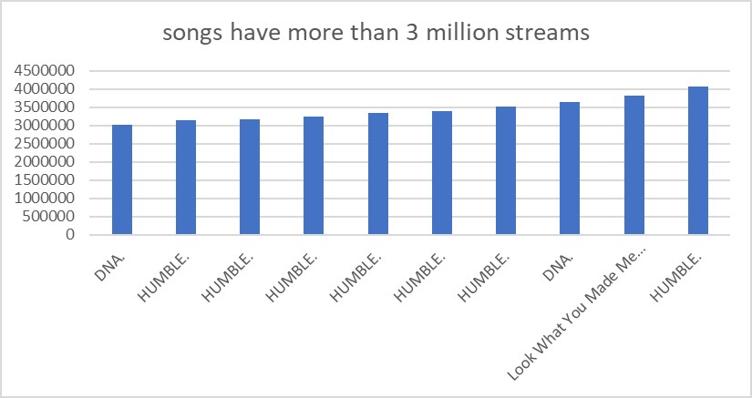
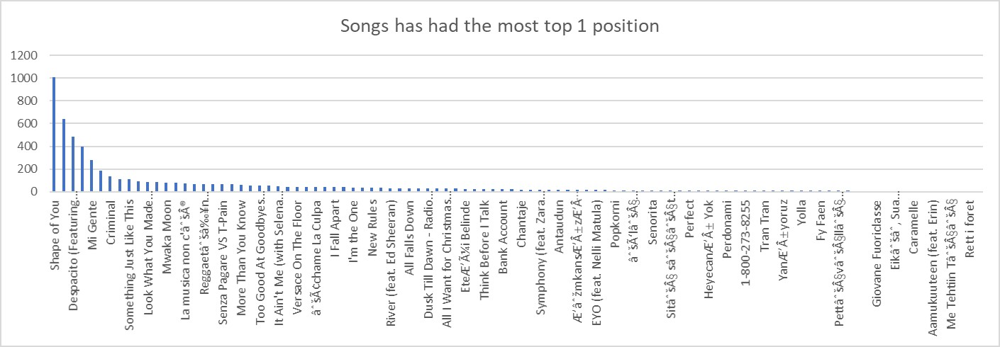
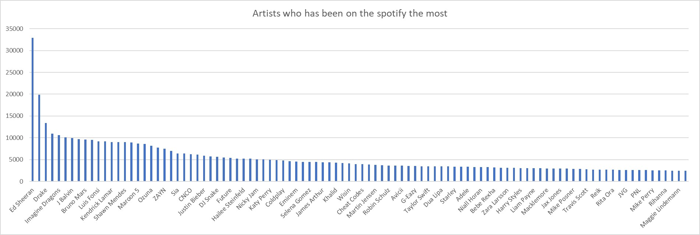
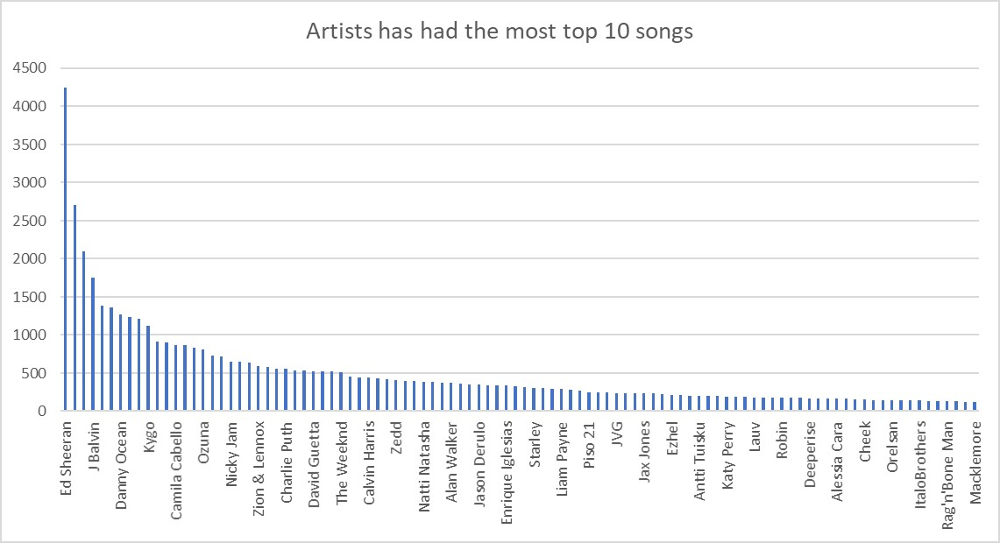
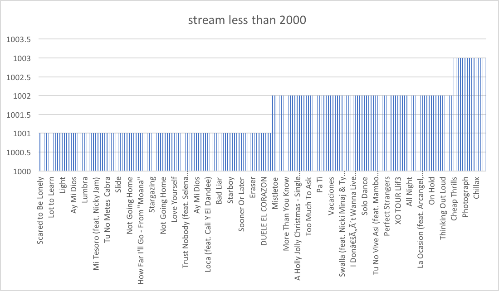

# Spotify Exercises

This table provides information about the ranking of popular songs worldwide. The following questions are provided with the correct
SQL query and graphs using the graphics function in Strata Scratch.

### Question 1
Which songs have more than 3 million streams?

*Solution:*
```sql
   SELECT trackname,
      artist,
      Streams
   FROM datasets.spotify_worldwide_daily_song_ranking
   WHERE streams>3000000
   ORDER BY streams ASC
   LIMIT 100
```


### Question 2
Which songs had been frequently in the top 1 position over the years?

*Solution:*
```sql
   SELECT trackname,
      count(*) AS TIME
   FROM datasets.spotify_worldwide_daily_song_ranking
   WHERE position=1
   GROUP BY "trackname"
   ORDER BY TIME DESC
   LIMIT 100 
```


### Question 3
Which artists have been on the Spotify the most?

*Solution:*
```sql
   SELECT artist,
      count (*) as top_artists
   FROM datasets.spotify_worldwide_daily_song_ranking
   GROUP BY artist
   ORDER BY top_artists DESC
   LIMIT 100 
```


### Question 4
Which artists had the most top 10 songs over the years?

*Solution:*
```sql
   SELECT artist,
      count(*) AS TIME
   FROM datasets.spotify_worldwide_daily_song_ranking
   WHERE position<=10 
   GROUP BY "artist"
   ORDER BY TIME DESC
   Limit 100.
```


### Question 5
Which songs have less than 2000 streams?

*Solution:*
```sql
   SELECT trackname,
      Streams
   FROM datasets.spotify_worldwide_daily_song_ranking
   WHERE streams< 2000
   ORDER BY streams ASC
   LIMIT 100
```


### Question 6
What are the top 10 songs listened to?

*Solution:*
```sql
   SELECT trackname
   FROM datasets.spotify_worldwide_daily_song_ranking
   WHERE position < 10
   GROUP BY trackname, position
   ORDER BY position ASC
   LIMIT 100
```

### Question 7
What is the average amount of streams of songs?

*Solution:*
```sql
   SELECT
      avg(streams)
   FROM datasets.spotify_worldwide_daily_song_ranking 
   LIMIT 100
```

*Output:* `48389`

### Question 8
How many streams are in the top 100?  

*Solution:*
```sql
   SELECT 
      count (*) as streams
   FROM datasets.spotify_worldwide_daily_song_ranking
   WHERE position <= 100
   LIMIT 100 
```

*Output:* `554906`

### Question 9
What is the highest stream of songs? 

*Solution:*
```sql
   SELECT max(streams) as max_streams
   FROM datasets.spotify_worldwide_daily_song_ranking 
   LIMIT 100 
```

*Output:* `4068152`

### Question 10
Which songs are placed in the positions 8-10?

*Solution:*
```sql
   SELECT *
   FROM datasets.spotify_worldwide_daily_song_ranking 
   WHERE  position in (8,9,10) 
   LIMIT 100
```
