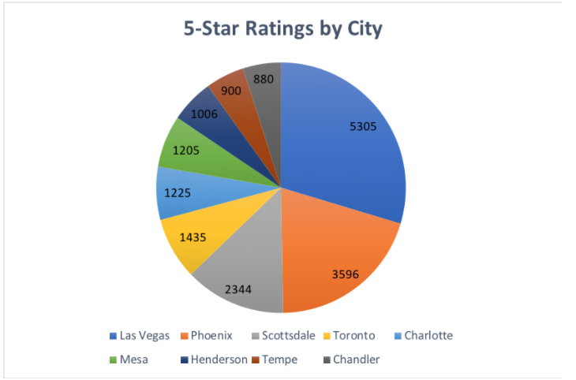
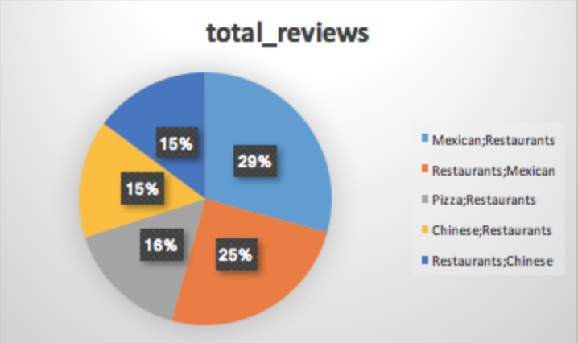
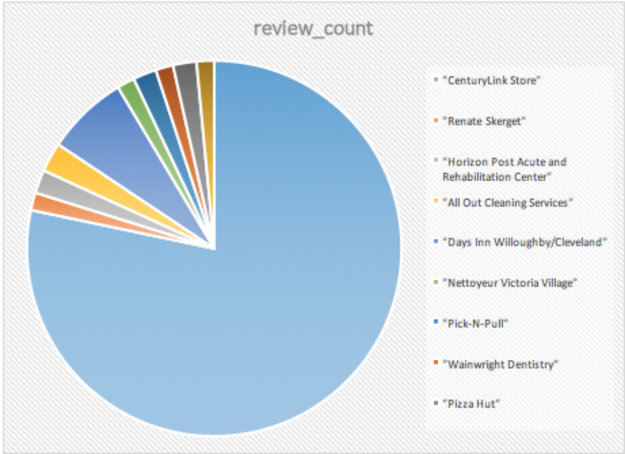
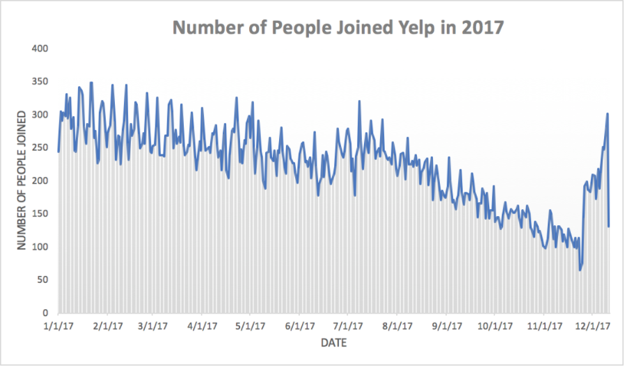
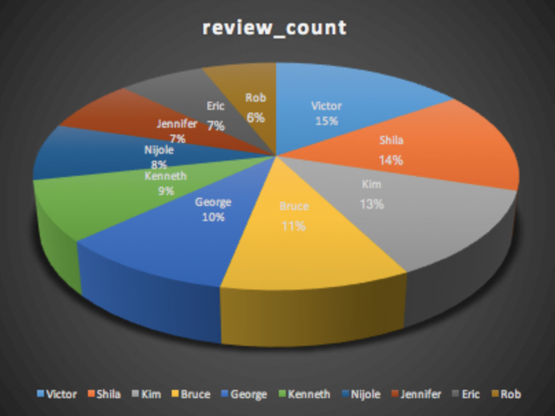

# Yelp Exercise Solutions
This exercise includes a table of various data gathered on Yelp. The following questions are provided with the correct SQL query solution
and graphs using the graphics function in Strata Scratch.

## Description of datasets.yelp_business 
The datasets.yelp_business table contains various data gathered on Yelp such as users, reviews, ratings, business address and categories. 

### Question 1 
What are the top 5 states with the most 5 star businesses?

*Solution:*
```sql
  SELECt count(stars) as count_of_5_stars, state
  FROM datasets.yelp_business
  WHERE stars = 5
  GROUP BY state
  ORDER BY count_of_5_stars DESC
```


### Question 2 
What are the top 5 cities with the most 5 star businesses? Limit visualization to 10.

*Solution:*
```sql
   SELECT count(stars) as count_of_5_stars, city
   FROM datasets.yelp_business
   WHERE stars = 5
   GROUP BY city
   ORDER BY count_of_5_stars DESC
```



### Question 3 
What are the top 5 businesses with the most reviews?

*Solution:*
```sql
   SELECT sum (review_count) as count_of_reviews, name
   FROM datasets.yelp_business
   GROUP BY name
   ORDER BY count_of_reviews DESC
   LIMIT 50
```


### Question 4 
What are the top category businesses most people review for?

*Solution:*
```sql
   SELECT sum(review_count) as total_reviews, categories
   FROM datasets.yelp_business
   GROUP BY categories
   ORDER BY total_reviews DESC
   LIMIT 5
```



### Question 5 
What are the most one star review business from yelp?

*Solution:*
```sql
   SELECT name, stars, review_count
   FROM datasets.yelp_business
   WHERE stars=1
   GROUP BY name, stars, review_count
   LIMIT 10
```



### Question 6 
How many businesses are open?

*Solution:*
```sql
   SELECT count(is_open) as business_open
   FROM datasets.yelp_business
   WHERE is_open = 1
```
*Output:* `146702`

### Question 7 
What is the average stars of each states?

*Solution:*
```sql
   SELECT  AVG(stars) as average_stars, state
   FROM datasets.yelp_business
   GROUP BY state
```

## Description of datasets.yelp_user
The datasets.yelp_user table includes information about Yelp users such as their name, when they joined Yelp, how many reviews they have written and characteristics of the reviews.

### Question 8
How many people joined yelp over the course of the year 2017?

*Solution:*
```sql
   SELECT count(name) as count_name, yelping_since
   FROM datasets.yelp_user
   WHERE yelping_since between '2017-01-01' and '2017-12-31'
   GROUP BY yelping_since
   ORDER BY yelping_since ASC
```



### Question 9
Who are the top 10 users that wrote the most reviews?

*Solution:*
```sql
   SELECT review_count, name
   FROM datasets.yelp_user
   ORDER BY review_count DESC 
   LIMIT 10
```



## Description of datasets.yelp_checkin
The  datasets.yelp_checkin table provides the amount of check-ins each business has and when that check-in took place. Check-ins are offered with rewards that businesses give to customers whenever they “check-in” to the business on Yelp. By using the check-in feature, customers are able to broadcast to their friends on Yelp that they're at your business.

### Question 10
What are the top 5 business with the most check-ins?

*Solution:*
```sql
   SELECT business_id,
      count (checkins) as check_in
   FROM datasets.yelp_checkin
   GROUP BY business_id
   ORDER BY check_in DESC
   LIMIT 5
```


