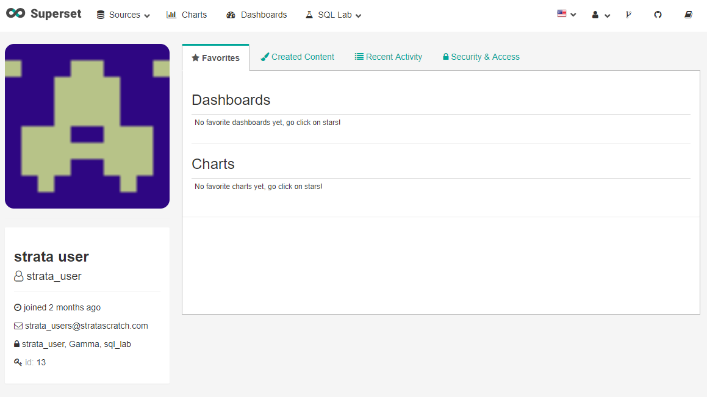
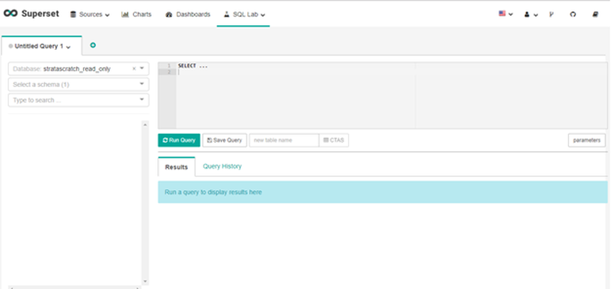
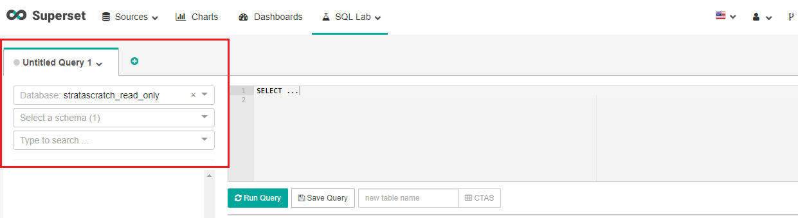
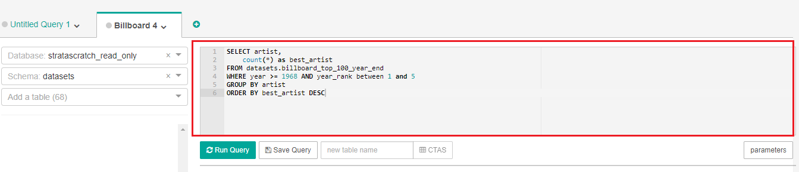
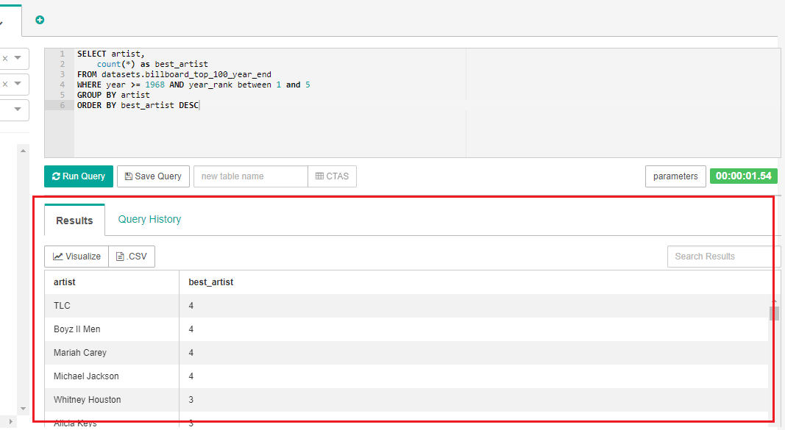
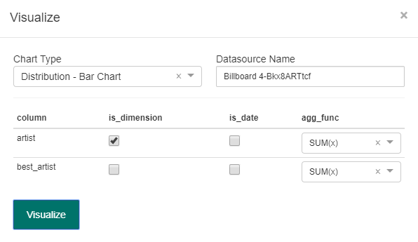
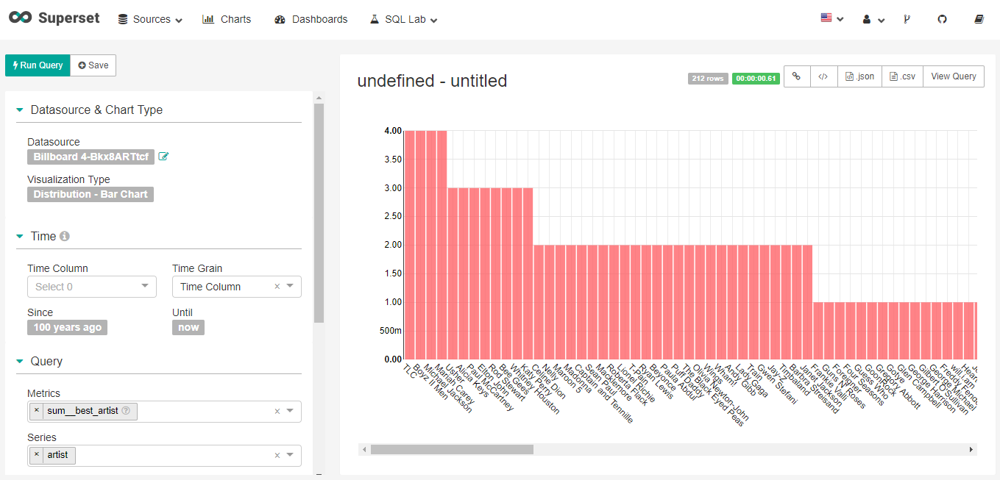
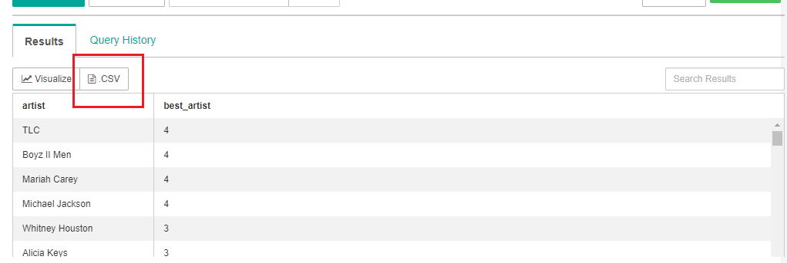
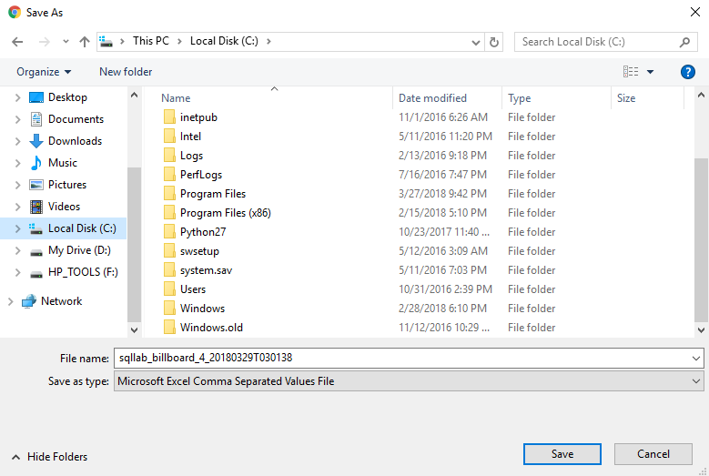
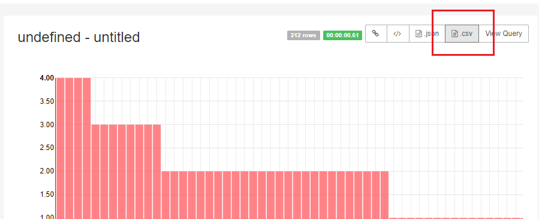

# Getting Started with Strata Scratch
Data analytical skills are important whether you are aspiring to become a data scientist or simply a student or a professional specializing a different field but somehow needs to deal with a large chunk of data. This page is the ideal place to start learning the basics about database programming and how to manipulate a massive amount of data using our platform. The steps below will first introduce you to SQL Lab and the basic functions you need to know to start using our platform effectively.

## The SQL Editor
Log in to your account to see your homepage as shown on the image below. The homepage consists of your account information, settings, tabs, and a number of dropdown menus located on the top toolbar. We will begin by exploring the functionalities of the SQL Lab menu which consists of all the basic tools you need to start your database. 

- Go ahead and click the SQL Lab menu. Here, you will see various options whether you want to start your SQL queries or upload your tables. 
- Under SQL Lab menu, choose SQL Editor.

The SQL editor is a powerful tool that allows you to type SQL commands, build and run queries, create and edit your data, visualize results, and many others.

## Accessing Public and Private Datasets
If you are a new user, you will see an untitled query tab on the left side of the page. Below the tab are configuration options which allow you to choose a database and dataset. A public schema dataset is uploaded by default for your convenience. It is composed of public datasets which you can use as a reference. However, the schema is read-only so you cannot make any changes to it.

You also have access to your own dataset repository under your private schema username where you will have full privileges, such as reading or editing your datasets. Under your private schema, you are given the freedom to move data from other schemas or upload your own CSV file.

## Running the SQL Query

Next to the configuration sidebar is a workspace where you can type SQL queries. You can start with basic commands such as SELECT, FROM, WHERE, GROUP BY and ORDER BY. We will learn more about this in the next tutorial. For now, it is enough for you to familiarize the functionality of the SQL editor. 

- To run a query, simply click on the Run Query box located below the workspace. For example, if you run the query typed on the editor above, you should be able to see the following query result:

## Visualizing Your Dataset
You can also have the option to visualize data and turn them into meaningful graphs.

- To start, click on the Visualize box located below the Results and Query History tabs

- A pop-up window will appear just like the image below. Here, you are given various options as to how you want to visualize your dataset. Under the Chart Type menu, choose what type of display you want for your plot. 

- Next to the Chart Type menu is the Datasource Name field. Simple type a name you desire for your plot. 
- Below the Chart Type menu are check boxes that provide options in visualizing your dataset. Check the desired attributes you wanted to include in your graph. For our example above, under column, we have the option to view the attributes (is_dimension and is_date) for artist and best_artist. The agg_func gives an option as to how you want to manipulate your data.
- Click the Visualize button to see the results which will open a new tab.

- As shown on the results above, you have further options to rename your chart located above the plot, as well as manipulate and filter your data through the sidebar configurations at the left side of the page.

## Saving a CSV File

- If you want to export your dataset to a CSV file, simply click on the .CSV button as shown below. 

- A pop-up window will appear to download the CSV file. Type the filename you want, choose a folder where you want to save the CSV and click the Save button. 

- Another option to save a CSV is to click the CSV button found above the chart (after you have built a visualization of your dataset):

Now you have the CSV file saved in your folder, you should be able to open it using a compatible program installed on your computer (such as MS Excel) to view your dataset.

