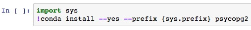
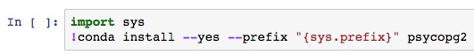
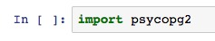

# How to Install psycopg2 to Connect to Strata Scratch Using Python

You can install `psycopg2` in your Jupyter notebook. You'll only need to install `psycopg2` once and after that, 
you merely need to `import psycopg2`.

1. Open a new Jupyter notebook

2. In the notebook type the command below:

```
import sys
!conda install --yes --prefix {sys.prefix} psycopg2
```


- If you receive an error, it's often because there's a space in your installation path and python can't find the correct place to install `psycopg2`. PCs typically have this problem so to solve this problem, just add double quotes around `"{sys.prefix}"` (refer to example below).

```
import sys
!conda install --yes --prefix "{sys.prefix}" psycopg2
```



3. To test if the installation was successful, type the following command in your Jupyter notebook.

```
import psycopg2
```


There will be no output or error if the code has been successfully executed. 

You are now ready to connect to the Strata Scratch database. Please refer to [How to Connect to Your Database using Python and Other Programs](https://github.com/stratascratch/stratascratch.github.io/blob/master/guides/how-to-connect-to-the-database-using-python-and-other-programs/how-to-connect-to-the-database-using-python-and-other-programs.md) to learn how to connect to our database.
