# How to Copy Data from One Table to Another

Copying or moving data from one place to another is one of the most common activities you will have to do when creating your database. This tutorial will cover the basics you need to learn in order to start copying fields of data to another table.

Strata scratch uses PostgreSQL dialect for database programming. If you are a beginner with minimal background in coding, then this easy-to-follow guide is the right page to start manipulating fields of data in your database.

Copying data from an existing table requires you to type the following statement into the editor:

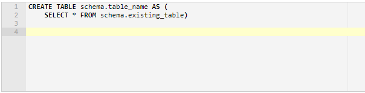

The CREATE TABLE AS statement allows you to create a new table in your database. To name your table, simply follow the syntax schema.table_name, where schema is the name of your private schema and table_name is the name you want to assign to your new table.

The SELECT statement is used to retrieve data from an existing table. You can follow the syntax SELECT * FROM schema.existing_table if you want to retrieve all the values available in the field. This method is very useful if you want to create a backup file for your table. 

## Copying Data from an Existing Table

To start, go to SQL Lab menu and click SQL editor.

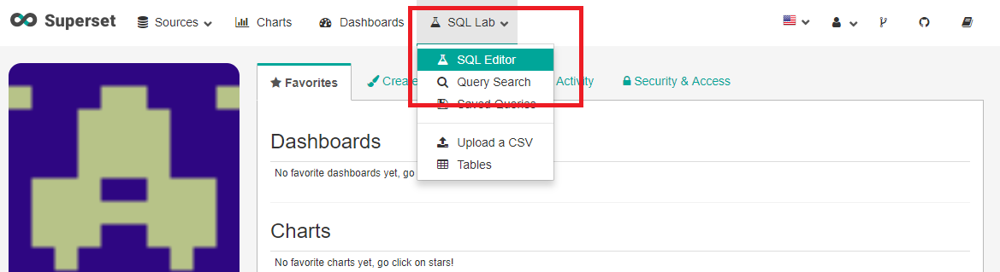

For a demonstration, we will create a new table named as backup_db and copy all the data from the existing table sample_db. So go ahead and type the following:

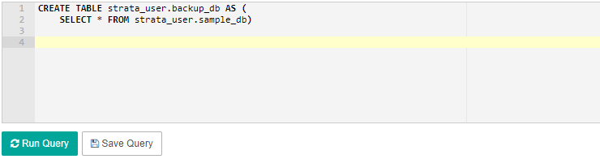

Click Run Query and you should verify on the results tab that the query is a success.

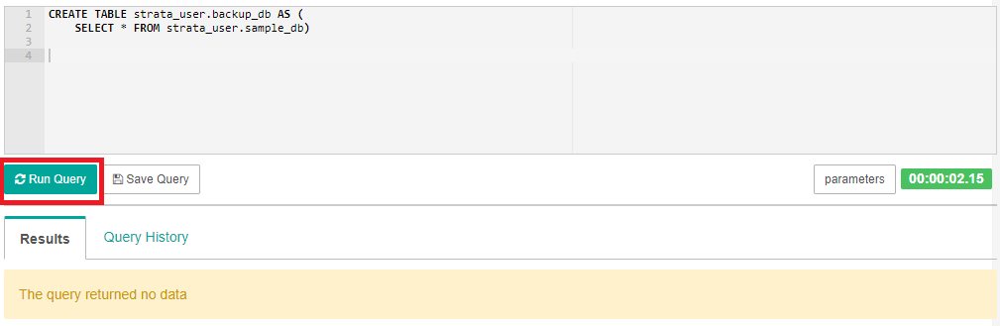

## Viewing the New Table

To view the new table you just created (in our example, backup_db is the name of our new table), type the following statement in the editor:

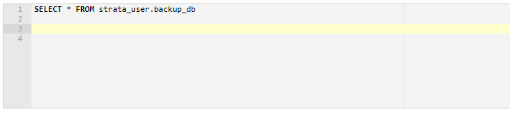

Click Run Query. Under the results tab, you should be able to view the data of the new table. In our example, we copied all the fields from the existing table sample_db to our new table backup_db. 

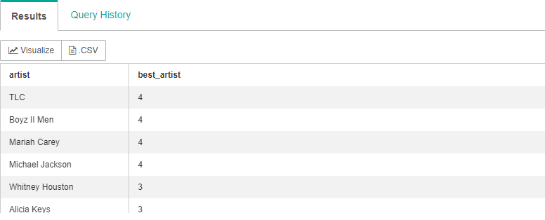

## Copying Data with a Condition Statement

If you want to copy only a particular set of data from an existing table, you can add a condition statement by using the WHERE clause. The WHERE clause allows you to copy only the data you wanted from an existing table to your new table. 

The syntax of the SELECT statement with the WHERE clause is as follows:

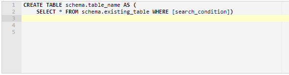

You can specify a search condition to filter out rows you do not need to copy by using comparison or logical operators such as >, <, and = operator.

For a demonstration, consider the table below named airbnb with the following records: 

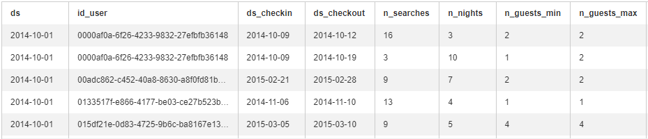

We are interested to create a new table and copy only the fields with more than 9 searches. Let us name our new table as airbnb_searches.

To start, type the following statement in the editor:

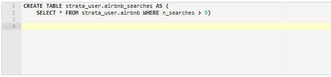

Click the Run Query box. You should be able to run the query successfully.

To view the new table, simple type the following statement:

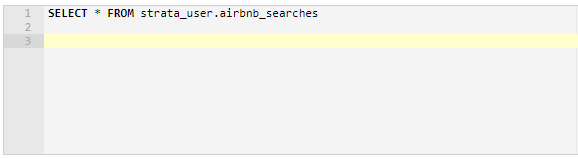

Click Run Query. You should be able to view the data under the results tab. Here, you will see that only the fields having more than 9 searches are shown in the table.

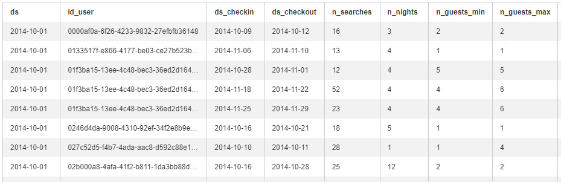

Now you have learned the basics on how to copy data from an existing table to a new table. You should be able to apply the syntax covered in this tutorial to start copying rows of data from one table to another.

