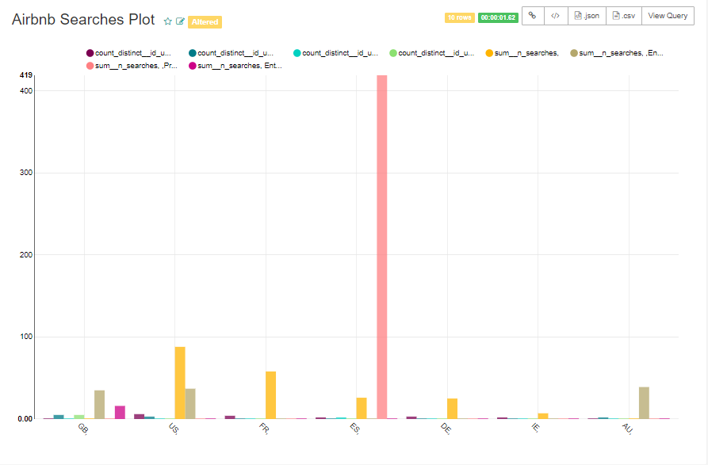
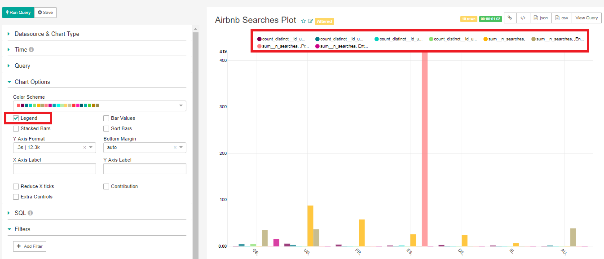

# How to Create Visualizations

Raw data is difficult to understand in its natural form. Data visualization allows you to gain more insights and see patterns rather than just looking directly at the stats, turning a massive amount of data into something meaningful. Luckily, Strata Scratch provides visualization solution that’s easy to use yet powerful enough to help you create beautiful and meaningful plots. This guide will lead you to the steps to start creating your first chart.

## Opening Your Dataset in SQL Editor

- Open the SQL editor.

- Under your schema, choose a table you want to visualize. For demonstration, let’s choose airbnb_searches table.

- Once you’ve selected your table, you should be able to view its parameters and data types at the left side of the page, and the preview of its contents below the editor.

- Now, let’s try to run a query. You can either type a SELECT statement on the editor, or copy a SELECT statement by clicking the small icon as shown on the image below:

- Right-click on the editor and choose paste.

- You should be able to see the SELECT statement on the editor. You may also try to edit this as you wish, by adding the LIMIT statement or other clauses to perform operations or manipulate the data you want to query.

- Click Run Query and you should be able to view the results successfully.

## Creating the Visualization Chart

- Now let’s try to plot our data. Under the results tab, click Visualize.

- You should see a pop-up window appear on the screen. The window will allow you to choose the chart type for your display, the datasource name, the parameters to display, and the aggregate functions. 

In our example below, let’s choose the distribution - bar chart for our display, and select the following parameters as shown on the image below. Then click Visualize.

The *is_dimension* attribute allows you to include variables you want to plot versus the time or date.

The *is_date* attribute considers the date to plot versus the chosen variables.

The *agg_func* allows you to perform computations on multiple rows, such as computing the average, sum, count, maximum and minimum values over a set of rows.

- Clicking the Visualize button will lead you to a new tab with the visualization results like the one shown below:

## Editing the Chart Filter Options

Strata scratch provides filter options so you can manipulate how you want to visualize your dataset. The left side of the page contains the settings where you can change the chart type and parameters to display.

#### Naming Your Chart

- To change the title of your chart, click the label on top of the chart as shown below. In our example, let’s name our chart as Airbnb Searches Plot.

#### Datasource and Chart Type
- Once you have created a chart, the datasource field specifies the name of the database where your datasets are stored. In our example, let’s keep the datasource as it is.
- The Visualization Type field specifies how you want your dataset to be displayed. So go ahead and click the box, and a pop-up window should appear on the page where you can select a chart type.

- On the pop-up window, choose the chart type appropriate for your dataset. For the purpose of demonstration, let’s keep the Distribution – Bar Chart type as it is.

#### Time

Next to the Datasource & Chart Type configuration is the Time menu. Here, you can configure the time related to the attributes included in the chart. 

- Choose the time column for the visualization by clicking the dropdown menu. This will be plotted against the filter options which will be shown in the next steps. Let’s say we choose *ds_checkout*.

- Define the time granularity for the visualization by clicking the Time Grain option. Here, we choose year which will be plotted with our time column.

- To further manipulate the time, click on the Since and Until option where you can type the time or period you want to be considered on the plot. Let’s say we want to consider 100 years ago until now, as shown below:

#### Query

- Under the Query tab, click on the Metrics dropdown menu to include multiple metrics to display. For example, let us choose *sum_n_searches* and *count_distinct_id_user*.

- To control how you want to group your dataset, click the Series menu. Here, we will choose *origin_country* and *filter_neighborhoods*.

- Define how each of the chosen series be broken down by clicking the Breakdowns option. Let’s say we want to break the series by room types by choosing *filter_room_types*.

- Limit the number of rows you want to include by choosing a value under the Row Limit dropdown menu. In our example, let’s choose a row limit of 10. 

- To see the changes in your graph, click Run Query on the top left-side of the page.

You should be able to see the graph as shown below:

#### Chart Options

The chart options allow you to configure how you want your plot to be rendered.

- Choose the color scheme you want to apply for your plot:

- Check the Legend box to view the legends of the plot.

- Check the Stacked Bars box if you prefer to view your plot in stacked bars, as shown below:

- Check the Bar Values box to display the value of the bars.

- You may also check the Sort Bars option to sort your data. 
- Click Run Query to view the result.

- You may also change the Y Axis Format and Bottom Margin. In our example, we will keep the settings as it is, as shown below:

- If you prefer to label the x-axis and y-axis, you can do so by filling-in the desired name in the corresponding fields.

- You may also reduce the number of ticks on the x-axis, add extra controls, and compute the contribution by checking any or all of the options below:

#### SQL

If you want to add more control to your query, you may add the WHERE and HAVING clauses under the SQL configuration. The WHERE clause is used to filter the rows of data you want to be considered on the plot, while the HAVING clause is used to manipulate groups through a condition.

- For example, let’s add the following WHERE clause to display only the number of maximum guests greater than 2 (for now, let’s leave the HAVING clause as blank).

- Click Run Query. You should get the following results:

#### Filter

- You can also add more filters as you wish, to further control how you want to render your data. Simply click the Add Filter button and fill-in the necessary attributes you want to be considered.

#### Saving Your Chart

- To save your chart, click the Save button located at the top left-side of the page.
 

- You should see a pop-up window appear on your screen. Here, you can choose to overwrite the slice you previously saved, or save a new slice. You may also add it to an existing dashboard, or create a new dashboard and add the slice. In our example, let’s prefer not to add it on a dashboard.

- Finally, click the Save button to save your work.

