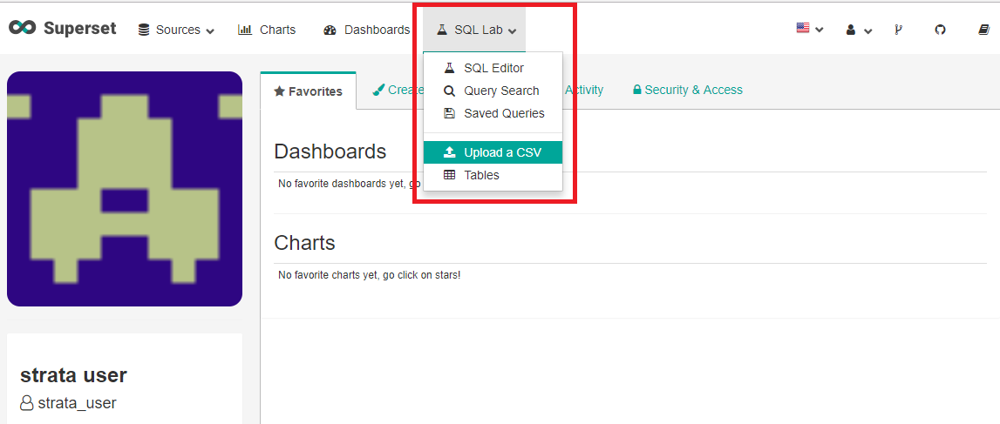
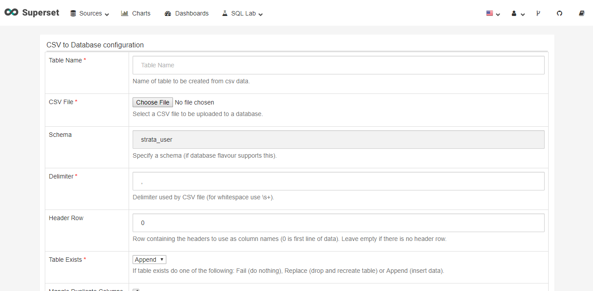
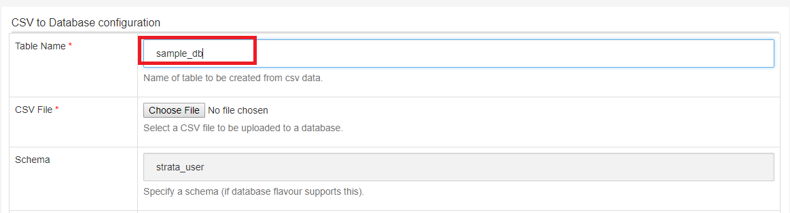
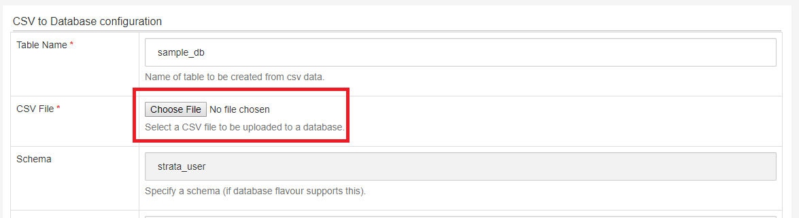
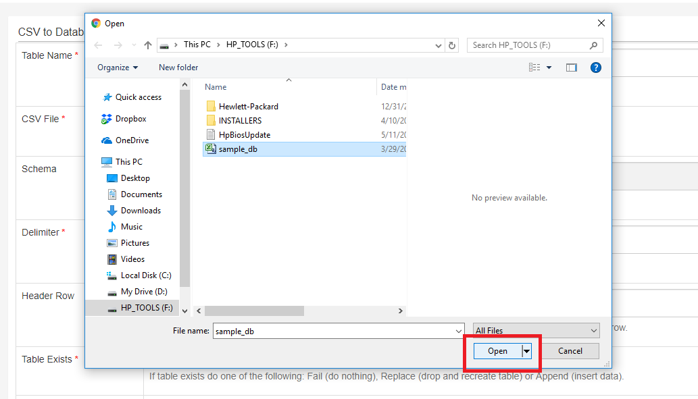
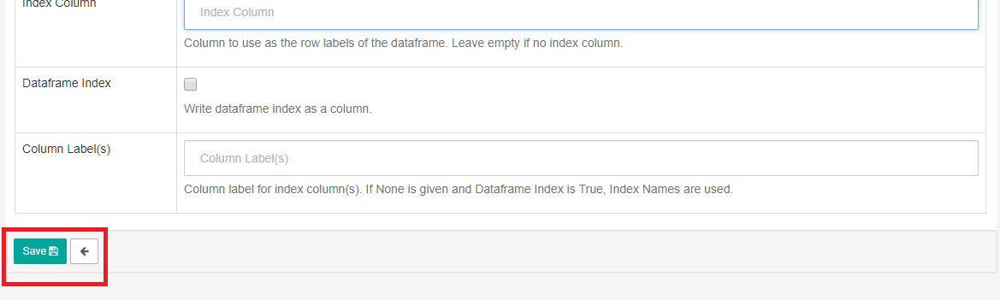
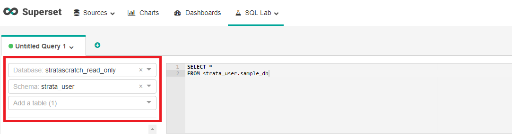
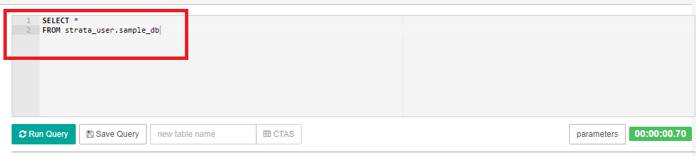
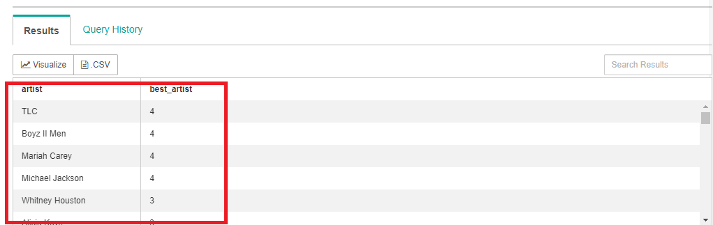

# How to Import a CSV File

Importing data from an external source to a database is a common database operation, whether you want to back-up your data, transfer databases, or simply create a meaningful dataset through the use of available analytical tools. The easy steps entailed to import a CSV file to your database will be covered in this short tutorial.

## Upload CSV File to SQL Lab

- In your account, go to the top toolbar and click the SQL Lab menu.
- Choose the Upload a CSV option.



- The next page you should see the Database Configuration Page. This is where you are going to create a table and provide information on the required fields prior to uploading your dataset.



## Create a Table Name
The first step for importing a CSV file is to provide a name for the table you will be creating. Type the name on the box provided next to the Table Name label. 

- Note that in the example below, we typed “sample_db” as the name of our table. It’s common practice to not include spaces, special symbols, and capital letters when naming your table.



## Upload Your CSV File
- On the next row, click Choose File to upload your CSV. 



- Go to the folder on your computer where your CSV file is saved, then click Open. In our example, we will upload our CSV with the filename “sample_db.csv” to our database.



## Fill-in the Rest of the Fields

### Schema
Next to the CSV File row is the Schema which is contained within the database. Schemas are composed of database objects created by a particular database user. In this example, “strata_user” is our username filled in on the schema field.   

### Delimiter
A delimiter in SQL is a symbol used to separate or define the end of each command. It can be any symbol, but in our example, we will use the default comma. 

### Header Row
In creating a table, the data under each column is generally represented by a label located in the first row. Row headings are used to label the data contained in each row. You can type 0 if the first row of data is used as headers for the columns; otherwise, leave the field empty if you don’t have a header row.

### Table Exists
This drop-down menu provides you options if a table exists. We will choose “Append” in our example to insert data into the table. 

### Mangle Duplicate Columns
Check this box if you want duplicate columns to be automatically specified as “X.0, X.1”.

###Skip Initial Space
Check this box if you don’t want the SQL to include spaces after a delimiter.

### Skip Rows
Enter the number of rows you want to skip at the start of the file. Otherwise, leave it blank.

### Rows to Read
Enter a number of rows of file you want the SQL to read.

### Skip Blank Lines
If you don’t want to blank lines to be misinterpreted as NaN (not a number) values, make sure to check this box.

### Parse Date
Sometimes you want to parse date values to easily store and manipulate data. Check this option to break down date values into predefined parts.

### Infer Datetime Format
Select the box to automatically interpret the datetime format.

### Decimal Character
Enter a symbol you want to represent as a decimal point. The default is the common period symbol.

### Index Column
Supply this field with the index column that you will use as row labels of the dataframe. Otherwise, leave this box blank.

### Dataframe Index
Select this box if you want to write the dataframe index as a column.

### Column Labels
Provide a column label in this field if you are using index columns. 

## Save Your CSV File
After you have supplied all the information needed for creating the table, you can now click the Save button located at the bottom of the page.



Now you have successfully uploaded your CSV file to the table you created. 

## How to Query A Table
- To query a table, go to the SQL editor. 
- On the left side of the page, select the name of the database and schema name. In our example, stratascratch_read_only is the name of the database and strata_user is the name of the schema.



In the editor, type the following commands:

```sql
SELECT *
FROM schema_name.table_name
```

The SELECT command returns data from a single or multiple tables. Using an asterisk will allow you to retrieve all the rows of data from the table.
The FROM statement includes the name of the table where you want to fetch your data.
For example, we can type the following statements in the editor to fetch all the rows of data from the sample_db table.



Click the Run Query button below the editor to query the table.


If the query is successful, you should be able to see the output under the Results tab.




