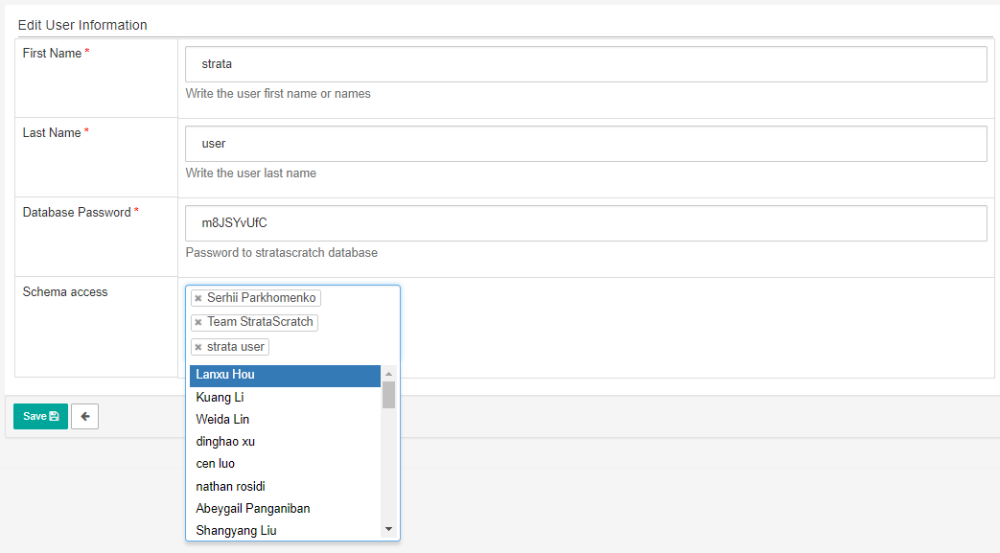

# How to Share Your Datasets With Other Users

Often times, you will need to share your dataset with other users to collaborate on a certain project or set of tasks. You can be a teacher sharing datasets with your students, or students sharing datasets with each other for a group project. This short guide will teach you how to achieve this using our Strata Scratch platform. 

- Log-in to your account. You should be able to see your dashboard, as shown below.

- On the right side of the page, go to the account icon and click Profile.

The next page will show your profile information, such as the one shown below:

The first tab contains the user info – your username, password, schema access which lists the users who have access to your database, profile status, the user role, and the number of log-ins.

The second tab contains your personal information – your first and last name, and your email address.

Below the Personal Info tab are options whether you want to edit your profile or reset your password.

- To start sharing your dataset, simply click on the Edit User box. This will open the Edit User Information page where you can edit your name, password, and users who have access to your database.

- Add or remove users who have access to your database by going to the Schema access field. To add a user, click this field to see a dropdown list of other users registered on the platform. In our example below, let’s say we want to add Lanxu Hou. Click the user’s name.

Note that the dropdown list contains all the users in Strata Scratch which is automatically generated in the platform. To avoid spending time on scrolling and searching other users, Strata Scratch is also equipped with autocomplete feature. You can simply start typing the name of the user and click on his/her name. 

- Once you have chosen the users you want to share your schema with, click the Save button to save the changes.

Take note that all shared datasets can only give a read-only access to the other users.

You have successfully shared your dataset with another user. You should be able to see the lists of users who have access to the database under the Schema Access field.

