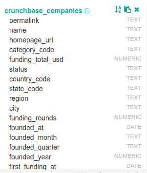
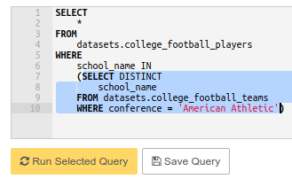

# Advanced SQL Guide

## Contents 

[SQL Data Types](#sql-data-types)
- [Data types](#data-types)
- [Changing a column's data type](#changing-data-type)

[SQL Date Format](#sql-date-format)
- [Why dates are formatted year-first](#dates-year-first)
- [Crazy rules for dates and times](#crazy-rules)

[Data Wrangling with SQL](#data-wrangling-with-sql)
- [What does it mean to “wrangle” data?](#what-does-it-mean-data-wrangling)

[Using SQL String Function to Clean Data](#sql-string-functions)
- [Cleaning strings](#cleaning-strings)
- [LEFT, RIGHT, and LENGTH](#left-right-len)
- [TRIM, LTRIM, RTRIM](#trim)
- [POSITION and STRPOS](#positions-strpos)
- [SUBSTR](#substr)
- [CONCAT](#concat)
- [Changing case with UPPER and LOWER](#change-case)
- [Turning strings into dates](#turn-str-to-date)
- [Turning dates into more useful dates](#turning-dates)
- [COALESCE](#coalesce)

[Writing Subqueries in SQL](#sql-subqueries)
- [Subquery basics](#subquery-basics)
- [Using subqueries to aggregate in multiple stages](#subquery-basics)
- [Subqueries in conditional logic](#subquery-logic)
- [Joining subqueries](#joining-subqueries)
- [Subqueries and UNIONs](#subqueries-unions)
 
[SQL Window Functions](#sql-window-functions)
- [Intro to window functions](#intro-to-window)
- [Basic windowing syntax](#basic-windowing-syntax)
- [SUM, COUNT, and AVG](#sum-count-avg)
- [ROW_NUMBER()](#row-number)
- [RANK() and DENSE_RANK()](#rank-and-dense-rank)
- [NTILE()](#ntile)
- [LAG and LEAD](#lag-lead)
- [Defining a window alias](#window-alias)

[Pivoting Data in SQL](#pivoting-data)
- [Pivoting Rows To Columns](#pivoting-rows)


This SQL guide is meant to help you grasp the advanced SQL concepts. This guide is adapted from Mode Analytics Advanced SQL which is a great tutorial for advanced SQL, however, this guide with the accompanying datasets provide a more hands-on experience that allows you to code live with tools used in industry, All tables found in the Mode Analytics guide are loaded in our databases but we added dozens more to get you better acquainted with SQL and analytics. 

# SQL Data Types

## Data types

Each column in your database has some data type.
Data types refer to the way your database looks at your data.
Some functions in SQL work only with specific data types so you need to know what types your column has. You can see the types of each column in the left side of the editor on the right side of the pane as seen in the following image.



The data types of SQL are
- TEXT and VARCHAR which are both strings (textual data) of any length
- BOOLEAN which can be either TRUE or FALSE
- NUMERIC which is any number (both integer and real numbers)
- INTEGER which is any integer number (including both negative, positive and 0)
- FLOAT which are real numbers
- DATE which are dates
- TIMESTAMP which are dates with a time component
- INTERVAL

Generally speaking COUNT works with any data types, SUM and AVG work with NUMERIC and other more advanced function which we see later in this guide require their specific data type.

## Changing a column's data type

Sometimes your data looks like numbers to you but for some reason the database thinks it is of type string. This happens often and the solution is easy.

```sql
SELECT 
    funding_total_usd :: NUMERIC
FROM
    datasets.crunchbase_companies
```

The code block above will convert the funding_total_usd to numeric. This can only be done if the type and value of funding_total_usd was convertible to numeric. For example if the values were strings like "100$" then they would not be convertible to numeric without preprocessing from your side.

There is another syntax for the same concept.

```sql
SELECT 
    CAST(funding_total_usd AS NUMERIC)
FROM
    datasets.crunchbase_companies
```

Casting is synonymous with converting types.

# SQL Date Format

## Why dates are formatted year-first

If you are an American you are used to dates written in format month/day/year and you believe that is the best way to write down dates but most relational databases do not agree with you and use the format year/month/day.

The reason behind that is simple. It does not matter if the dates are stored as strings or as DATE/TIMESTAMP objects they will yield a chronological sorting when in this format. If databases were to use the American standard for formatting dates then sorting by string characters won't be the same as chronological sorting.

Very often you will have to use string processing procedures to clean your dates to be in year/month/day format but for now you have clean dates in `datasets.crunchbase_companies` so things are easier.

## Crazy rules for dates and times

When your columns have the proper type (DATE or TIMESTAMP) you can do many things with them:
- Substract two columns to see the difference in time between them
- Add a fixed amount of time to a column to get a value in the future or in the past
- Extract a component of the timestamp (e.g. year) and groupby that component
- etc

It is important to note that you can convert your string column to a timestamp using (`my_column :: TIMESTAMP`) and use the operations we will learn now.

The first example shows the difference between two dates which is of type INTEGER.

```sql
SELECT 
    permalink,
    founded_at,
    first_funding_at,
    first_funding_at - founded_at AS time_till_money_in_days,
    founded_at + 30 <= first_funding_at AS funded_early 
FROM
    datasets.crunchbase_companies
```

Notice that when you substract two dates you get the number of days between them. This number can be negative if the first date is future compared to the second date.

We calculate two new columns:
- `time_till_money_in_days` which is the number of days starting from founding date to first funding date.
- `funded_early` which is a boolean telling us if the company was funded really soon after it got founded. We see that we can add days to a date and we can compare dates.

In the next example we will learn about INTERVAL and NOW functions

Here we filter away all companies which are older than 4 years, 6 months and 54 days.
We also do some other filters because there are some inconsistent entries where the founding date is around 2080 and companies getting funded before getting founded.

```sql
SELECT 
    permalink,
    founded_at,
    first_funding_at
FROM
    datasets.crunchbase_companies
WHERE 
    founded_at :: TIMESTAMP >= NOW() - INTERVAL '4 years 6 months 54 days' AND
    founded_at :: TIMESTAMP <= NOW() AND
    founded_at <= first_funding_at
```

- INTERVAL allows you define any time intervals using plain English.
- NOW() gets the current time as a timestamp value.

Remember adding and substracting intervals works only with timestamps so you need to convert your date or string columns to timestamps.

# Data Wrangling with SQL

## What does it mean to “wrangle” data?

From [Wikipedia](https://en.wikipedia.org/wiki/Data_wrangling):
    Data munging or data wrangling is loosely the process of manually converting or mapping data from one “raw” form into another format that allows for more convenient consumption of the data with the help of semi-automated tools.

Simply put data wrangling means fixing all weird stuff that happens because people collecting the data were too lazy to enter all values or they made typos or you lost some data because of a power outage or excel crashed when you least expected or some other reason. 

Before you can do any meaningful analysis on your data you must pass through this step to ensure that you have a valid and consistent data.

# Using SQL String Function to Clean Data

We will use the table found in `datasets.sf_crime_incidents_2014_01`

This lesson features data on San Francisco Crime Incidents for the 3-month period beginning November 1, 2013 and ending January 31, 2014. It was collected from the SF Data website on February 16, 2014

## Cleaning strings

All functions we use here expect strings as inputs.

## LEFT, RIGHT, and LENGTH

`LEFT` takes two inputs:
- string to operate on
- number of characters to extract from the beginning of the string (beginning = left side)

**Example**: `LEFT('I am a string', 6)` gives `'I am a'`

`RIGHT` works similarly except it works from the end of the string (end = right side)

**Example**: `RIGHT('A string I am', 4)` gives `'I am'`

Here we use these two functions to get the year and day components of our date.

```sql
SELECT
    id,
    LEFT(date :: TEXT, 4) as year_string,
    RIGHT(date :: TEXT, 2) as day_string,
FROM
    datasets.sf_crime_incidents_2014_01

```

`LENGTH` gives the number of characters in the string.

In the following example we order the rows of our dataset on the length of the crime description text.

```sql
SELECT
    id,
    descript,
    LENGTH(descript) AS lenny
FROM
    datasets.sf_crime_incidents_2014_01
ORDER BY lenny DESC
```

## TRIM, LTRIM, RTRIM, BTRIM

Trimming means removing characters from start of the string, end of the strings or both start and end.

There are 3 parameters:
- Side which is one of LEADING, TRAILING, BOTH
- Choice of characters to trim away (in our example '()')
- Column to apply the trimming on (in our example location)

```sql
SELECT 
    location,
    TRIM(BOTH '()' FROM location) AS trimmed_b,
    TRIM(LEADING '()' FROM location) AS trimmed_l,
    TRIM(TRAILING '()' FROM location) AS trimmed_r
FROM datasets.sf_crime_incidents_2014_01
```

* `LTRIM(location, '()')` is a shorthand for `TRIM(LEADING '()' FROM location)`
* `RTRIM` is shorthand for `TRAILING` and `BTRIM` is shorthand for `BOTH`

## POSITION and STRPOS

`POSITION` allows us to find the location of the first character in some column which is a match with what we seek.

For example `POSITION ('0' IN 'Number 0 is cool')` will give us 8 while ``POSITION ('0' IN 'No zeros here')` will give us back 0 as the output.

```sql
SELECT
    address, 
    POSITION('0' IN address) as pos
FROM datasets.sf_crime_incidents_2014_01
```

We don't have to limit ourselves only to characters but we can use any substring in the position call.

For example `POSITION('C#' IN 'Quartet in C#')` will give us 11 which is the position where 'c#' was first found in the given string.

`STRPOS` is an alternative way to do the same task. It takes two arguments:
- String which holds the substring
- Substring to find the position for

`POSITION('C#' IN 'Quartet in C#')` is equal to `STRPOS('Quartet in C#', 'C#')`

## SUBSTR

This function allows us to slice the string from any position up to a specified number of characters. It takes 3 parameters:
- string to slice
- start position
- number of characters to take

For example `SUBSTR('Vienna Opera House', 7, 6)` will give us `'Opera'`.

This can come in handy to parse dates as the following example shows.

The date is of format : `yyyy-mm-dd`

```sql
SELECT
    incidnt_num,
    date,
    SUBSTR(date :: TEXT, 6, 2) AS extracted_month
FROM datasets.sf_crime_incidents_2014_01
```

## CONCAT

`CONCAT` allows us to glue a sequence of strings into a single string.

It has a variable number of parameters all of them strings.

For example `CONCAT('I ', 'am ', 'becoming ', 'a ', 'SQL Guru')` will give the single string `'I am becoming a SQL Guru'`.

We can use `CONCAT` to make a nice description of the date when the crime happened. 

```sql
SELECT
    incidnt_num,
    CONCAT(day_of_week, ', ', date, ' at ', time) AS formatted_datetime
FROM datasets.sf_crime_incidents_2014_01
```

There is an alternative version of concat denoted by two pipes (||)

```sql
SELECT
    incidnt_num,
    address || ' Resolved As: ' || resolution AS resolution_description
FROM datasets.sf_crime_incidents_2014_01
```

`address || ' Resolved As: ' || resolution` is the same as `CONCAT(address, ' Resolved As: ', resolution)`

## Changing case with UPPER and LOWER

Both of these function take a single parameter which they transform into an all upper case string or all lower case string.
* `LOWER('LOUD')` gives `'loud'`
* `UPPER('quiet')` gives `'QUIET'`

```sql
SELECT
    incidnt_num,
    LOWER(pd_district) AS low_pd_district
FROM datasets.sf_crime_incidents_2014_01
```

## Turning strings into dates

We can turn a single date format into another which can come in handy for presentation purposes.

The procedure for that is to split the original date format into pieces (3 strings, one for year, one for month and one for day) and combine these pieces.
* To split into pieces we use LEFT, RIGHT and SUBSTR.
* To combine the pieces we use CONCAT or ||

In this example we start from dates formatted like yyyy-mm-dd (database standard) and which are of type DATE and in the end
get dates formatted like dd-mm-yyyy which are of type string.

```sql
SELECT
    incidnt_num,
    date,
    (RIGHT(date::TEXT, 2) || '-' || SUBSTR(date :: TEXT, 6, 2) || '-' || LEFT(date::TEXT, 4)) AS new_date
FROM datasets.sf_crime_incidents_2014_01
```

## Turning dates into more useful dates

This section is not about strings. It is about dates which are of nice clean yyyy-mm-dd format and of type date or are castable to date.

To make our analysis easier we can extract various parts of the date from the DATE object using the `EXTRACT` operation.

The syntax is `EXTRACT(component_as_string FROM column)`

```sql
SELECT date,
       EXTRACT('year'   FROM date) AS year,
       EXTRACT('month'  FROM date) AS month,
       EXTRACT('day'    FROM date) AS day,
       EXTRACT('decade' FROM date) AS decade,
       EXTRACT('dow'    FROM date) AS day_of_week
  FROM datasets.sf_crime_incidents_2014_01
```

There is an alternative solution with the DATE_PART function.

`DATE_PART('year', date)` is same as `EXTRACT('year' FROM date)`

You can get the current time and date through a variety of functions shown next.

By the way you can invoke any function on constant or no data by using a query with only SELECT and no FROM.

```sql
SELECT CURRENT_DATE AS date,
       CURRENT_TIME AS time,
       CURRENT_TIMESTAMP AS timestamp,
       LOCALTIME AS localtime,
       LOCALTIMESTAMP AS localtimestamp,
       NOW() AS now
```

You can make a time appear in a different time zone using AT TIME ZONE:

```sql
SELECT CURRENT_TIME AS time,
       CURRENT_TIME AT TIME ZONE 'PST' AS time_pst
```

## COALESCE

Very often you have null values in your data and they cause all form of headaches when filtering and joining and make counts look wrong and can cause many other issues.

One solution to handling null values is the `COALESCE` function.

It takes an unlimited number of parameters and returns the first one which is NOT NULL.

Examples:
- COALESCE(12) = 12
- COALESCE(NULL, 12) = 12
- COALESCE(NULL, 12, NULL, 42) = 12
- COALESCE(NULL, NULL, NULL, 12) = 12
- COALESCE(NULL, NULL, NULL, NULL, NULL) = NULL

The dataset used in this example (san francisco crimes) was also cleaned from nulls so no SQL example is provided.

# Writing Subqueries in SQL

Subqeries are also known as inner queries or nested queries.

Each query returns a SQL table as a result.
This means you can combine queries.

## Subquery basics

First let's see an example and then a discussion of it follows.

We will use `college_football_players` and `college_football_teams` datasets.

In this example we want to find players whose college conference is 'American Athletic'

```sql
SELECT
    *
FROM
    datasets.college_football_players
WHERE 
    school_name IN 
    (SELECT DISTINCT
        school_name
    FROM datasets.college_football_teams
    WHERE conference = 'American Athletic')
```

This master query is made up from the outer part and the inner part.

Let's start with the inner part.

```sql
    (SELECT DISTINCT
        school_name
    FROM datasets.college_football_teams
    WHERE conference = 'American Athletic')
```

First you notice that we wrapped the query in brackets. We must do this when we write subqueries.

This query returns a list of schools whose conference is 'American Athletics'

Execute it in Strata Scratch to see that it returns Memphis, Houston, Louisville, UCF and few other cities.

Pro tip: You can select blocks of code and execute them. This is super useful when writing sub queries.



The results of this query are then passed up so the outer query applies its filter using the IN operation to check if the school name is one of Memphis, Houston, etc.

## Using subqueries to aggregate in multiple stages

Sometimes you might need to perform an aggregation over a set of columns and then perform another aggregation over a subset of these columns. 

Here is an example that makes this concept less abstract.

In the inner query we find the player count for each position and state.

In the outer query we find the average player count over all positions for each state.

```sql
SELECT
    state,
    AVG(player_count) AS avg_player_count
FROM
    (SELECT
        position,
        state,
        COUNT(*) AS player_count
    FROM
        datasets.college_football_players
    GROUP BY position, state) sub_query
GROUP BY state
```

Try running the inner subquery first and then the whole query.

When writing complex queries like this one we always first write the inner one and then around it slowly build the outer one.

Also notice that we have to write an alias `sub_query` for our subquery here. In the previous example we did not have to write one. Generally you always need to write table aliases unless your subquery is part of some condition as it was in the example above.


## Subqueries in conditional logic

This was the topic of our introductory example but we don't have to restrict ourselves to IN operations.

For example to find the player which has the largest weight we can use the following query.

```sql
SELECT *
FROM datasets.college_football_players
WHERE 
    weight = (SELECT MAX(weight)
              FROM datasets.college_football_players)
```

## Joining subqueries

You can do filtering in joins but you can also filter and then join.

To filter first and then join can be really good for performance because more rows you have in tables getting joined it will be slower to finish the joining procedure.

In this example we perform an implicit join between `datasets.college_football_players` and `datasets.college_football_teams` after the teams dataset was filtered.

```sql
SELECT
    players.*,
    filtered_teams.roster_url
FROM 
    datasets.college_football_players players,
        (SELECT 
            school_name, 
            roster_url
         FROM 
            datasets.college_football_teams
         WHERE 
           conference IN ('Big Ten')
        ) filtered_teams
WHERE
    players.school_name = filtered_teams.school_name
```

## Subqueries and UNIONs

You can combine the results of two subqueries using UNION.

For example to make a single dataset from pieces you can use UNIONs.

```sql
SELECT *
  FROM datasets.crunchbase_investments_part1

 UNION ALL

 SELECT *
   FROM datasets.crunchbase_investments_part2
```

# SQL Window Functions

## Intro to window functions

Window functions are functions which take many rows of a single column and return a single aggregate value. They are called like that because they utilize the concept of a sliding window.
Sliding windows mean taking some values, calculating the aggregation and then moving one step forward and taking the next value, etc.

For example if you had the following values in a column:
- 4
- 13
- 7
- 19
- 25
- 6

A sliding window of size 2 would operate on:
- 4 and 13
- 13 and 7
- 7 and 19
- 19 and 25
- 25 and 6

A sliding window of size 3 would operate on
- 4, 13 and 7
- 13, 7 and 19
- 7, 19 and 25
- 19, 25 and 6

When we say operate we mean perform some aggregation function like SUM or AVG.

A practical example is the running total:

```sql
SELECT duration_seconds,
       SUM(duration_seconds) 
       OVER (ORDER BY start_time) AS running_total
FROM datasets.dc_bikeshare_q1_2012
```

The new keyword is `OVER` which tells the query executor that we want to use a window function here. `OVER (ORDER BY start_time)` means apply the window function over all rows ordered by start_time.

By default the window size is unbounded which means that it will calculate using all preceding rows before the current row.

## Basic windowing syntax

In our example above we only used `OVER` however it is possible to `PARTITION` the data (similar to groupby) and apply the window function to each partition individually.

The syntax is `aggregate_function(...) OVER (PARTITION BY ...)`. 

`ORDER BY` is optional and if it is not supplied the natural ordering of rows is used for the window functions.

For example assume we had the following table named `fictional_data`:
- id | value
- 0 | 1
- 0 | 3
- 0 | 5
- 1 | 2
- 1 | 4
- 1 | 6

We have two different ids and 3 values for each id

The following query 

```sql
SELECT
    id,
    value,
    SUM(value)
    OVER
    (PARTITION BY id) AS running_value
FROM fictional_data
```

gives us the following results:
- id | value | running_value
- 0  | 1     | 1
- 0  | 3     | 4 (4 = 1 + 3)
- 0  | 5     | 9 (9 = 4 + 5 = 1 + 3 + 5)
- 1  | 2     | 2 (running_value resets here because a new partition begins)
- 1  | 4     | 6 (6 = 2 + 4)
- 1  | 6     | 12 (12 = 6 + 6 = 6 + 4 + 2)

Notice that with partition and windowing functions we do not make groups. `GROUP BY` and `PARTITION BY` are different. Actually you can't use both in the same query unless you split the query into subqueries.

A real example based on a real dataset is partitioning on the start terminal and then calculating the rolling total like we did in the section above. Notice that `ORDER BY` works after `PARTITION` so the rows will be ordered independently for all partitions and after they are ordered the window function (in this case `SUM`) is called.

```sql
SELECT start_terminal,
       duration_seconds,
       SUM(duration_seconds)
       OVER
       (PARTITION BY start_terminal ORDER BY start_time)
       AS running_total
FROM datasets.dc_bikeshare_q1_2012
WHERE start_time < '2012-01-08'
```

Try the query without the `ORDER BY` clause. What happened?

## SUM, COUNT, and AVG

Just like we used SUM as the window function we can also use COUNT and AVG which we know from groupby.

Here is an example of using AVG to calculate the rolling average on the historical opening price of AAPL stock.

```sql
SELECT 
    date,
    AVG(open) 
    OVER(
        ORDER BY date
        ROWS BETWEEN 15 PRECEDING AND 15 FOLLOWING
    ) AS rolling_mean
FROM datasets.aapl_historical_stock_price
```

When you plot the raw opening price time series and the timeseries which is the result of this query you can see that this curve is much smoother and actually represents the trend line.

We have some new syntax here:
* `ROWS BETWEEN 15 PRECEDING AND 15 FOLLOWING`

In our examples before this was not coded and was implicitly set to be:
* ` ROWS BETWEEN UNBOUNDED PRECEDING AND 0 FOLLOWING`

Let's demistify what it means:
- `15 PRECEDING` means whenever you calculate the window function for row i take all rows which are 15 rows behind it (after the ordering). In our example this means 15 days before.
- `15 FOLLOWING` means that you take 15 rows after the current row i (of course the ordering happens first). In our example that means 15 days after.
- When both are present in our example it means take a window of 30 days, 15 days in the past and 15 days in the future. This is an example of a centered sliding window with current row under execution being the center.

In our previous example we had windows which were not centered.

`UNBOUNDED` means take everything before/after the current row.

An example of using `COUNT`

```sql
SELECT 
    year,
    date,
    COUNT(*)
    OVER(
        PARTITION BY year
        ORDER BY date
    ) AS count
FROM datasets.aapl_historical_stock_price
```

Here we have a running count of number of rows for every year ordered by the date.
This gives us the possibility to see how the data collection effort progressed during the years.

## ROW_NUMBER()

ROW_NUMBER() tells you the row number in the partition or just ordering of the record under inspection.

For example if we take our `fictional_data` from above:
- id | value
- 0 | 1
- 0 | 3
- 0 | 5
- 1 | 2
- 1 | 4
- 1 | 6

```sql
SELECT
    id,
    value,
    ROW_NUMBER()
    OVER(PARTITION BY id)
FROM fictional_data
```

We get:
- id | value | row_number
- 0  | 1 | 1 (first row is number 1)
- 0  | 3 | 2 (second rows is number 2)
- 0  | 5 | 3 (and so on)
- 1  | 2 | 1 (new partition, row_number restarts from 1)
- 1  | 4 | 2 (second row in new partition is number 2)
- 1  | 6 | 3 (et cetera)

Here is a real example using the `billboard_top_100_year_end` dataset.

```sql
SELECT
    year_rank,
    year,
    artist,
    song_name,
    ROW_NUMBER()
    OVER (PARTITION BY year_rank ORDER BY year) AS row_number
FROM datasets.billboard_top_100_year_end
```

## RANK() and DENSE_RANK()

`RANK` is similar to `ROW_NUMBER` except that these two have different behaviours when the rows are equal under the comparison criteria. For example we do `OVER (ORDER BY start_time)` and two rows have the same `start_time`:
- ROW_NUMBER() will give the first row a value of lets say 10 and second row of 11
- RANK() will give them both a value of 10. If there were more than two each would get the rank 10 while row number would go 11, 12, 13, 14 and so on.

`DENSE_RANK` is like `RANK` with the difference that `RANK` will skip values while `DENSE_RANK` won't. To clarify with an example. Assume 1, 2, 3, 4, 5, 6 are row numbers and rows 1, 2 are the same and rows 4, 5 are the same for `RANK` criteria to be considered equal.
- RANK() would give us back 1 for 1, 1 for 2, 3 for 3, 4 for 4, 4 for 5, 6 for 6
- DENSE_RANK() would give us back 1 for 1, 1 for 2, 2 for 3, 3 for 4, 3 for 5, 4 for 6

Notice how `RANK()` skips values and gives a rank of 3 to row 3  after the rank 1 for rows 1 and 2 while `DENSE_RANK()` gives a rank of 2 for row 3.

Here is a practical example:

```sql
SELECT start_terminal,
       duration_seconds,
       RANK() OVER (PARTITION BY start_terminal
                    ORDER BY start_time)
              AS rank
FROM datasets.dc_bikeshare_q1_2012
WHERE start_time < '2012-01-08'
```

## NTILE()

This function allows us to find percentiles and quartiles.
* NTILE(4) gives back four possible values 1, 2, 3, 4 for quartile
* NTILE(100) gives back a 100 possible value, each denoting a single percentile.

The quartile/percentile is calculated from the numbers present in the column defined in the `ORDER BY` part of the query (in this example `open`, the opening price)

We find the percentiles and quantiles of the opening price for every year using that year's data.

```sql
SELECT
    year,
    NTILE (4) 
    OVER (PARTITION BY year ORDER BY open) AS quartile,
    NTILE(100) 
    OVER (PARTITION BY year ORDER BY open) AS percentile
FROM datasets.aapl_historical_stock_price
```

## LAG and LEAD

These two functions allow us to shift the time series data we use.
- LAG(n) will shift the series towards the past for n positions.
- LEAD(n) will shift towards the future for n positions.

See the results of the following query to get a feeling for it.

```sql
SELECT
    date,
    open,
    LAG(open, 1) -- shift by 1 position to the past
    OVER(ORDER BY date) AS prev_open
FROM datasets.aapl_historical_stock_price
```

open and prev_open are in a relation such that open at row i is equal to prev_open at row i + 1.

Notice that the first prev_open is null because there is no data before the first open value we must put null here. To have 25.6 for example we can use COALESCE as in the following example.

```sql
SELECT
    date,
    open,
    COALESCE(LAG(open, 1) 
             OVER(ORDER BY date), 
             25.6) AS prev_open
FROM datasets.aapl_historical_stock_price
```

A common use case for LAG is to calculate differences in the series.

```sql
SELECT
    date,
    open,
    LAG(open, 1) 
    OVER(ORDER BY date)
    AS prev_open,
    open -  LAG(open, 1) 
    OVER(ORDER BY date) AS difference
FROM datasets.aapl_historical_stock_price
```

Think about how would you deal with the null values in the first row of the output.

## Defining a window alias

Sometimes you will use the same window in multiple output columns like in the example above so to save some typing we can use window aliases.

`WINDOW date_window AS (ORDER BY date)` will define `date_window` which we can use in our query.

```sql
SELECT
    date,
    open,
    -- notice that we go over date_window
    LAG(open, 1) OVER (date_window) AS prev_open,
    open -  LAG(open, 1) OVER (date_window) AS difference
FROM datasets.aapl_historical_stock_price
-- this is the window alias
WINDOW date_window AS (ORDER BY date) 
```

Think about how to use window aliases to shorten the NTILE example.

# Pivoting Data in SQL

## Pivoting Rows To Columns

We will start with the dataset defined by the following query:

```sql
SELECT
    position,
    college,
    AVG(heightinches) AS avg_height
FROM datasets.nfl_combine
WHERE year = 2014
GROUP BY position, college
```

We use `datasets.nfl_combine` and take data only for year 2014. This table has 3 columns and many rows.

Our goal here is to make a table whose columns are positions, whose rows are colleges and whose values are average heights in inches.

```sql
SELECT DISTINCT position FROM datasets.nfl_combine
```

First we need to find which positions exist and the query above does just that.

After that we start building our pivoting query CASE by CASE at a time.

```sql
-- Positions are NT, C, FS, DE, CB, QB, OT, LS, TE, ILB, P, K
SELECT
    college,
    (CASE WHEN position = 'NT' THEN avg_height ELSE NULL END) AS NT_avg_height,
    (CASE WHEN position = 'C' THEN avg_height ELSE NULL END) AS C_avg_height
FROM
    (SELECT
        position,
        college,
        AVG(heightinches) AS avg_height
    FROM datasets.nfl_combine
    WHERE year = 2014
    GROUP BY position, college
    ) sub
```

The inner query is what we started with and whose results we want to pivot.
In the outer query we have the college and a list of case statements of the form
`(CASE WHEN position = 'NT' THEN avg_height ELSE NULL END) AS NT_avg_height`
The logic behind this is:
```
    if position for that row is 'NT' then put the average height into the column called NT_avg_height.

    otherwise we have no data in this for that college and position 'NT' so we must put null here
```

To build the whole pivoting table we continue with the same logic.

The final query is

```sql
-- Positions are NT, C, FS, DE, CB, QB, OT, LS, TE, ILB, P, K
SELECT 
    college,
    MAX(NT_avg_height) AS NT_avg_height,
    MAX(C_avg_height) AS C_avg_height,
    MAX(FS_avg_height) AS FS_avg_height,
    MAX(DE_avg_height) AS DE_avg_height,
    MAX(CB_avg_height) AS CB_avg_height,
    MAX(QB_avg_height) AS QB_avg_height,
    MAX(OT_avg_height) AS OT_avg_height,
    MAX(LS_avg_height) AS LS_avg_height,
    MAX(TE_avg_height) AS TE_avg_height,
    MAX(ILB_avg_height) AS ILB_avg_height,
    MAX(P_avg_height) AS P_avg_height,
    MAX(K_avg_height) AS K_avg_height
FROM
(SELECT
    college,
    (CASE WHEN position = 'NT' THEN avg_height ELSE NULL END) AS NT_avg_height,
    (CASE WHEN position = 'C'  THEN avg_height ELSE NULL END) AS C_avg_height,
    (CASE WHEN position = 'FS' THEN avg_height ELSE NULL END) AS FS_avg_height,
    (CASE WHEN position = 'DE' THEN avg_height ELSE NULL END) AS DE_avg_height,
    (CASE WHEN position = 'CB' THEN avg_height ELSE NULL END) AS CB_avg_height,
    (CASE WHEN position = 'QB' THEN avg_height ELSE NULL END) AS QB_avg_height,
    (CASE WHEN position = 'OT' THEN avg_height ELSE NULL END) AS OT_avg_height,
    (CASE WHEN position = 'LS' THEN avg_height ELSE NULL END) AS LS_avg_height,
    (CASE WHEN position = 'TE' THEN avg_height ELSE NULL END) AS TE_avg_height,
    (CASE WHEN position = 'ILB' THEN avg_height ELSE NULL END) AS ILB_avg_height,
    (CASE WHEN position = 'P' THEN avg_height ELSE NULL END) AS P_avg_height,
    (CASE WHEN position = 'K' THEN avg_height ELSE NULL END) AS K_avg_height
FROM
    (SELECT
        position,
        college,
        AVG(heightinches) AS avg_height
    FROM datasets.nfl_combine
    WHERE year = 2014
    GROUP BY position, college
    ) sub
) sub2
GROUP BY sub2.college
```

Notice that we added an extra group by college call at the outermost college and MAX aggregations.
The reason behind this has to do with the nature of our inner query which builds the pivot table.
Assume some college has 3 positions, that means that we will have 3 rows in out pivot table where each row has null in all positions except its positions. We use the groupby to combine these 3 rows so that we have 1 row in the output with multiple columns having non-null values.

Also don't fret out if you see huge queries. Real life stuff tends to be like that.

This was the manual way of pivoting and it's what you'll do when things are manageable like it was here but nothing beats automation and to that end we recommend you learn about [tablefunc and crosstab](https://www.postgresql.org/docs/9.2/static/tablefunc.html)
