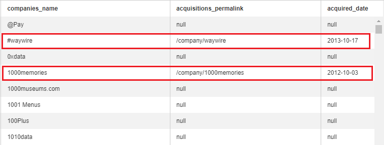
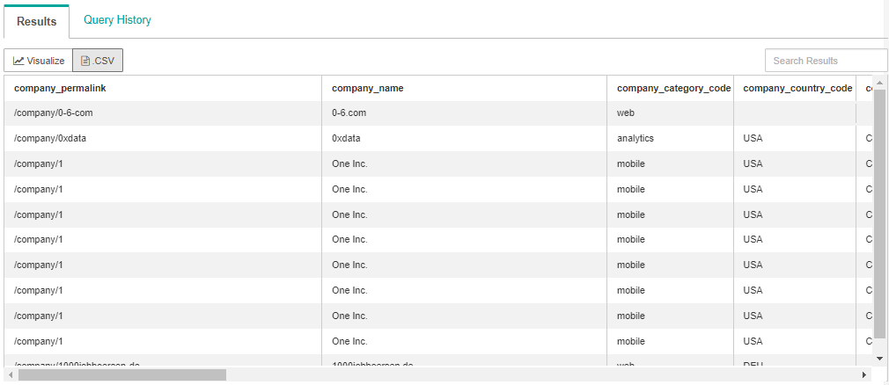

# Intermediate SQL Guide

## Contents

[Intermediate SQL](#intermediate-sql)
- [CASE STATEMENT](#case-statement)
- [JOINS](#joins)
- [JOIN clause](#join-clause)
- [Deconstructing the JOIN clause](#deconstructing-the-join-clause)
- [INNER JOIN](#inner-join)
- [OUTER JOINS](#outer-joins)
- [LEFT JOIN](#left-join)
- [RIGHT JOIN](#right-join)
- [FULL OUTER JOIN](#full-outer-join)
- [UNION & UNION ALL](#union)
- [SQL JOIN Comparison Operators](#join-comparison)
- [SQL JOIN on multiple keys](#join-multiple-keys)
- [SQL SELF JOIN](#self-join)

This SQL guide is meant to help you get started with intermediate level concepts of SQL. It's assumed the reader knows the basics and is good for beginners that need a reference when coding. This guide is adapted from Mode Analytics Intro to SQL which is a great introduction to SQL, however,this guide with the accompanying datasets provide a more hands-on experience that allows you to code live with tools used in industry. All tables found in the Mode Analytics guide are loaded in our databases but we added dozens more to get you better acquainted with SQL and analytics. 

### CASE STATEMENT

The CASE statement is SQL’s way of handling if/then logic. The CASE statement is followed by at least one pair of WHEN and THEN statements—SQL’s equivalent of IF/THEN in Excel. It must end with the END statement. The ELSE statement is optional, and provides a way to capture values not specified in the WHEN/THEN statements. CASE is easiest to understand in the context of an example:

```sql
SELECT player_name,
       year,
       CASE WHEN year = 'SR' THEN 'yes'
            ELSE 'no' END AS is_a_senior
FROM datasets.college_football_players
```

- The case statement in this example will output a `yes` value for any year with a `SR` value. If the row does not have a `SR` value, the output is `no`. 


#### Adding multiple conditions to a CASE statement

```sql
SELECT player_name,
       weight,
       CASE WHEN weight > 250 THEN 'over 250'
            WHEN weight > 200 THEN '201-250'
            WHEN weight > 175 THEN '176-200'
            ELSE '175 or under' END AS weight_group
  FROM datasets.college_football_players
```

Output:


- You can add as many conditions by adding multiple WHENs. 
- There can only be one ELSE statement which is always last in your CASE WHEN. 

# Advanced SQL
### JOINS

Up to this point, we’ve only been working with one table at a time. The real power of SQL, however, comes from working with data from multiple tables at once.

To understand what joins are and why they are helpful, let’s think about Twitter.

Twitter has to store a lot of data. Twitter could (hypothetically, of course) store its data in one big table in which each row represents one tweet. There could be one column for the content of each tweet, one for the time of the tweet, one for the person who tweeted it, and so on. It turns out, though, that identifying the person who tweeted is a little tricky. There’s a lot to a person’s Twitter identity—a username, a bio, followers, followees, and more.

In an organization like this, Twitter will have hundreds of tables, each storing some attribute about the user, tweet, and/or action. If we just have a user table and tweet table, you can store data like this —the first table—the users table—contains profile information, and has one row per user. The second table—the tweets table—contains tweet information, including the username of the person who sent the tweet. By matching—or joining—that username in the tweets table to the username in the users table, Twitter can still connect profile information to every tweet.

Here’s an example using a different dataset:

```sql
SELECT teams.conference AS conference,
       AVG(players.weight) AS average_weight
FROM datasets.college_football_players players
JOIN datasets.college_football_teams teams
    ON teams.school_name = players.school_name
GROUP BY teams.conference
ORDER BY AVG(players.weight) DESC
```

Can you guess what the query is trying to achieve? We’ve covered all aspects of the SQL query except for the JOIN clause.

- In this query, the SELECT clause tells us what information is going to be displayed. We’re interested in the average weight of college football players by conference.


### JOIN clause

In the example above, the JOIN clause joins the `college_football_players` and `college_football_teams` tables together, presumably so that we can link player attributes with team attributes.

But how do we JOIN two tables together? The key is the `ON` clause. With the `ON` clause, you’re selecting a column in one table and matching it with a column in another table. In this case, we’re taking `school_name` from `datasets.college_football_teams` and matching it with `school_name` from `datasets.college_football_players`.

### Deconstructing the JOIN clause 

Let’s take only the FROM and JOIN clauses from the example above:

```sql
FROM datasets.college_football_players players
JOIN datasets.college_football_teams teams
    ON teams.school_name = players.school_name
```

- `FROM`: pick a table to start
- You can nickname the table for easy reference. In this case, I’ve named the `datasets.college_football_players` table as `players`. 
- I use `players` in the `ON` clause so that I don’t have to type the name of the entire table again (`datasets.college_football_players`). 
- `JOIN`: pick the table you’re interested in joining. Just like with the `FROM` clause, you can nickname the table. In this case, I nicknamed the table  `datasets.college_football_teams` as `teams`. 
- The `ON` clause matches columns from both tables so that the tables can join together. In this case, I’m matching `school_name` from both tables. 

### INNER JOIN

In the football example above, all of the players in the `players` table match to one school in the `teams` table. But what if the data isn’t so clean? What if there are multiple schools in the `teams` table with the same name? Or if a player goes to a school that isn’t in the teams table?

If there are multiple schools in the `teams` table with the same name, each one of those rows will get joined to matching rows in the `players` table. For example, if there was a player named `Michael Campanaro` and if there were three rows in the `teams` table where `school_name = 'Wake Forest'`, an inner join would return three rows with `Michael Campanaro`.

It’s often the case that one or both tables being joined contain rows that don’t have matches in the other table. The way this is handled depends on whether you’re making an inner join or an outer join.

We’ll start with inner joins, which can be written as either `JOIN datasets.college_football_teams teams` or `INNER JOIN datasets.college_football_teams` . Inner joins eliminate rows from both tables that do not satisfy the join condition set forth in the `ON` statement. In mathematical terms, an inner join is the intersection of the two tables.

<p align="center">
  
</p>

Therefore, if a player goes to a school that isn’t in the `teams` table, that player won’t be included in the result from an inner join. Similarly, if there are schools in the `teams` table that don’t match to any schools in the `players` table, those rows won’t be included in the results either.

### OUTER JOINS

When performing an inner join, rows from either table that are unmatched in the other table are not returned. In an outer join, unmatched rows in one or both tables can be returned. There are a few types of outer joins — LEFT JOIN, RIGHT JOIN, and FULL OUTER JOIN.


### LEFT JOIN

<p align="center">
  
</p>

Let’s start by running an INNER JOIN on the `Crunchbase` dataset and taking a look at the results. We’ll just look at `company-permalink` in each table, as well as a couple other fields, to get a sense of what’s actually being joined.

```sql
SELECT companies.permalink AS companies_permalink,
       companies.name AS companies_name,
       acquisitions.company_permalink AS acquisitions_permalink,
       acquisitions.acquired_at AS acquired_date
FROM datasets.crunchbase_companies companies
JOIN datasets.crunchbase_acquisitions acquisitions
    ON companies.permalink = acquisitions.company_permalink
```

You may notice that “280 North” appears twice in this list. That is because it has two entries in the `datasets.crunchbase_acquisitions` table, both of which are being joined onto the `datasets.crunchbase_companies` table.


Now try running that query as a LEFT JOIN:

```sql
SELECT companies.permalink AS companies_permalink,
       companies.name AS companies_name,
       acquisitions.company_permalink AS acquisitions_permalink,
       acquisitions.acquired_at AS acquired_date
FROM tutorial.crunchbase_companies companies
LEFT JOIN datasets.crunchbase_acquisitions acquisitions
    ON companies.permalink = acquisitions.company_permalink
```

You can see that the first two companies from the previous result set, `waywire` and `1000memories`, are pushed down the page by a number of results that contain null values in the `acquisitions_permalink` and `acquired_date` fields.



This is because the LEFT JOIN command tells the database to return all rows in the table in the FROM clause, regardless of whether or not they have matches in the table in the LEFT JOIN clause.

### RIGHT JOIN

Right joins are similar to left joins except they return all rows from the table in the RIGHT JOIN clause and only matching rows from the table in the FROM clause.

<p align="center">
  
</p>

RIGHT JOIN is rarely used because you can achieve the results of a RIGHT JOIN by simply switching the two joined table names in a LEFT JOIN. For example, in this query of the Crunchbase dataset, the LEFT JOIN section:

```sql
SELECT companies.permalink AS companies_permalink,
       companies.name AS companies_name,
       acquisitions.company_permalink AS acquisitions_permalink,
       acquisitions.acquired_at AS acquired_date
FROM datasets.crunchbase_companies companies
LEFT JOIN datasets.crunchbase_acquisitions acquisitions
    ON companies.permalink = acquisitions.company_permalink
```

produces the same results as this query:

```sql
SELECT companies.permalink AS companies_permalink,
       companies.name AS companies_name,
       acquisitions.company_permalink AS acquisitions_permalink,
       acquisitions.acquired_at AS acquired_date
FROM datasets.crunchbase_acquisitions acquisitions
RIGHT JOIN datasets.crunchbase_companies companies
    ON companies.permalink = acquisitions.company_permalink
```

The convention of always using LEFT JOIN probably exists to make queries easier to read and audit, but beyond that there isn’t necessarily a strong reason to avoid using RIGHT JOIN.

It’s worth noting that LEFT JOIN and RIGHT JOIN can be written as LEFT OUTER JOIN and RIGHT OUTER JOIN, respectively.

### FULL OUTER JOIN

LEFT JOIN and RIGHT JOIN each return unmatched rows from one of the tables—FULL JOIN returns unmatched rows from both tables. It is commonly used in conjunction with aggregations to understand the amount of overlap between two tables.

Here’s an example using the `Crunchbase companies and acquisitions` tables:

```sql
SELECT COUNT(CASE WHEN companies.permalink IS NOT NULL AND acquisitions.company_permalink IS NULL
                  THEN companies.permalink ELSE NULL END) AS companies_only,
       COUNT(CASE WHEN companies.permalink IS NOT NULL AND acquisitions.company_permalink IS NOT NULL
                  THEN companies.permalink ELSE NULL END) AS both_tables,
       COUNT(CASE WHEN companies.permalink IS NULL AND acquisitions.company_permalink IS NOT NULL
                  THEN acquisitions.company_permalink ELSE NULL END) AS acquisitions_only
FROM datasets.crunchbase_companies companies
FULL JOIN datasets.crunchbase_acquisitions acquisitions
    ON companies.permalink = acquisitions.company_permalink
```

Output:


### UNION & UNION ALL

SQL joins allow you to combine two datasets side-by-side, but UNION allows you to stack one dataset on top of the other. Put differently, UNION allows you to write two separate SELECT statements, and to have the results of one statement display in the same table as the results from the other statement.

Let’s try it out with the Crunchbase investment data, which has been split into two tables for the purposes of this lesson. The following query will display all results from the first portion of the query, then all results from the second portion in the same table:

```sql
SELECT *
   FROM datasets.crunchbase_investments_part1

 UNION

SELECT *
   FROM datasets.crunchbase_investments_part2
```
Output:



Note that UNION only appends distinct values. More specifically, when you use UNION, the dataset is appended, and any rows in the appended table that are exactly identical to rows in the first table are dropped. If you’d like to append all the values from the second table, use UNION ALL. You’ll likely use UNION ALL far more often than UNION. In this particular case, there are no duplicate rows, so UNION ALL will produce the same results:

```sql
SELECT *
   FROM datasets.crunchbase_investments_part1

 UNION ALL

SELECT *
   FROM datasets.crunchbase_investments_part2
```
Output:


SQL has strict rules for appending data:
- Both tables must have the same number of columns
- The columns must have the same data types in the same order as the first table

While the column names don’t necessarily have to be the same, you will find that they typically are. This is because most of the instances in which you’d want to use UNION involve stitching together different parts of the same dataset (as is the case here).

Since you are writing two separate SELECT statements, you can treat them differently before appending. For example, you can filter them differently using different WHERE clauses.

### SQL JOIN Comparison Operators

We want to find companies which were acquired by acquiriers from same city and within 3 years of their founding.

To satisfy these two conditions we need to know the founding date, acquisition date, company city and acquirier city.

We can find all of these except the founding date in `datasets.crunchbase_acquisitions`. To get the founding date we need `datasets.crunchbase_companies` and its `founded_at` column.

Our ON section consists of 3 conditions:
- 1. join key equality condition on permalink.
- 2. cities must be equal for both company and its acquirier
- 3. check to see if the founding date is at most 3 years apart from the acquisition date

The third condition shows how we can use any form of condition in our joins.
- We check `datasets.crunchbase_companies.founded_at` against `datasets.crunchbase_acquisitions.acquired_at` and neither of them are primary keys.

```sql
SELECT 
    companies.*
FROM
        datasets.crunchbase_acquisitions acquisitions 
    INNER JOIN
        datasets.crunchbase_companies companies
    ON 
        -- Join Key comparison - We want to match companies with their acquiriers
        acquisitions.company_permalink = companies.permalink AND
        -- Arbitrary equal comparison - Company acquirer must be from same city condition
        companies.city = acquisitions.acquirer_city AND
        -- Arbitrary less equal comparison - Company must be acquired at most 3 years from founding
        companies.founded_at <= acquisitions.acquired_at - 3
```

Note that the query we just discussed and the following query are different because the first query filters during join, while the second one filters and joins afterwards.

```sql
SELECT 
    companies.*
FROM
        datasets.crunchbase_acquisitions acquisitions 
    INNER JOIN
        datasets.crunchbase_companies companies
    ON 
        -- Join Key comparison - We want to match companies with their acquiriers
        acquisitions.company_permalink = companies.permalink AND
        -- Arbitrary equal comparison - Company acquirer must be from same city condition
        companies.city = acquisitions.acquirer_city
WHERE
    companies.founded_at <= acquisitions.acquired_at - 3
```

### SQL JOIN on multiple keys

Sometimes your datasets will have multiple columns as their primary key and to perfom an accurate join you must join on equality for all these keys.

Another benefit of joins is that sometimes they can be sped up if you use multiple keys. The reason for this is the indexing done by the database in the background.

```sql
SELECT 
    *
FROM datasets.crunchbase_companies companies 
    INNER JOIN 
        datasets.crunchbase_acquisitions acq
    ON 
    companies.permalink = acq.company_permalink AND
    companies.name      = acq.company_name
```

### SQL SELF JOIN

In addition to joining two different tables you can join a table to itself.

Joining a table to itself follows the same syntax and logic like other joins. The primary difference is that now you have the same table but under two different aliases. 

Notice that we use the same table but under different aliases (`companies1` and `companies2`)

```sql
        datasets.crunchbase_companies companies1 
    FULL JOIN 
        datasets.crunchbase_companies companies2
```

Joining a table to itself allows doing things regular group by can't do like our example here demonstrates. 

We want to find all companies which share a common category_code.
If we stopped here a groupby would do the job perfectly but we also want to only include
companies whose total funding is somewhat similar (that is the difference in total funding is less than 100000$) 

So we join the `datasets.crunchbase_companies` table against itself and make a few tests:
- The first test is to ensure that we do not include the same company in output. This is necessary because when we do a FULL JOIN each company is checked against each other company, including itself from the other table.
- Our second check is to ensure that they have a common category_code
- The third check is the funding difference check. ABS is the absolute function in SQL.

```sql
SELECT 
    companies1.category_code AS category_code,
    companies1.permalink AS company1_permalink,
    companies2.permalink AS company2_permalink,
    companies1.funding_total_usd AS company1_total_funding,
    companies2.funding_total_usd AS company2_total_funding,
    ABS(companies1.funding_total_usd  - companies2.funding_total_usd) AS funding_difference
FROM datasets.crunchbase_companies companies1 
    FULL JOIN 
        datasets.crunchbase_companies companies2
    ON 
        companies1.permalink <> companies2.permalink AND
        companies1.category_code = companies2.category_code AND
        ABS(companies1.funding_total_usd - companies2.funding_total_usd) <= 100000
ORDER BY funding_difference ASC
```